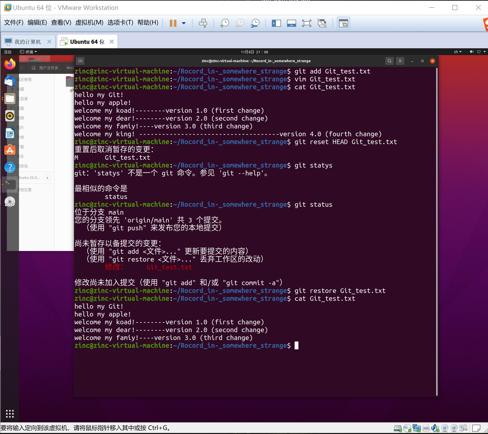

问题1：若你已经修改了部分文件、并且将其中的一部分加入了暂存区，应该如何回退这些修改，恢复到修改前最后一次提交的状态？给出至少两种不同的方式  
=====
&ensp;&ensp;&ensp;&ensp;(1）可以使用 "git reset HEAD <filename>" 将最后一次修改的版本拉至暂存区，再用 "git checkout -- <filename>" ,将其拉到工作区，可发现，文件退了一个版本，即撤销了最后一次的修改。  
&ensp;&ensp;&ensp;&ensp;(2）使用 "git reset HEAD <filname>" ，之后再使用 "git restore" ，效果与上条一致。  

    
问题2：若你已经提交了一个新版本，需要回退该版本，应该如何操作？分别给出不修改历史或修改历史的至少两种不同的方式  
=====
&ensp;&ensp;&ensp;&ensp;(1）不修改历史，可以使用 "git log" ,查看每次提交的 "commit ID" ，将想回退的那次 "commit ID" 复制下来，并使用 "git reset <commit ID> --hard" 即可。  
&ensp;&ensp;&ensp;&ensp;(2）历史已被修改，可以使用 "git reflog" ,查看所有操作记录，包括被删除的，复制想要回退版本的哈希值，即 "comit ID" ，再使用 "git reset <commit ID> --hard" 即可。    

    
    
问题3：我们已经知道了合并分支可以使用 merge，但这不是唯一的方法，给出至少两种不同的合并分支的方式  
=====
&ensp;&ensp;&ensp;&ensp;(1）可使用 "git cherry-pick <commit ID>" 将分支合并。  
&ensp;&ensp;&ensp;&ensp;(2）也可·使用 "git merge –no-ff <branch name>" 将分支合并。(暂未实现)     
