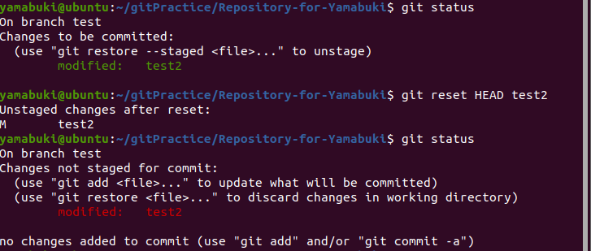
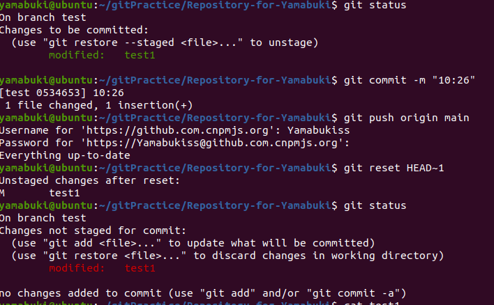

1、若你已经修改了部分文件、并且将其中的一部分加入了暂存区，应该如何回退这些修改，恢复到修改前最后一次提交的状态？给出至少两种不同的方式

分为两种情况 已经提交以及未提交

未提交:

此时需使用 git reset HEAD (filename)

则可退回暂存区的修改

若还想退回工作区的修改 则需要在 git reset HEAD (filename) 之后使用 git checkout --(filename) 的操作

已提交:

此时需使用 git reset (--mixed(默认)/soft/hard) HEAD~(回退版本次数) 

此时则回将本地版本库回退到指定的版本库

若还想要退回工作区的修改 则添加hard参数
