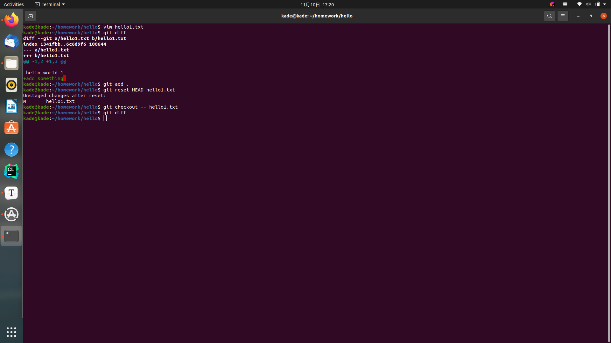
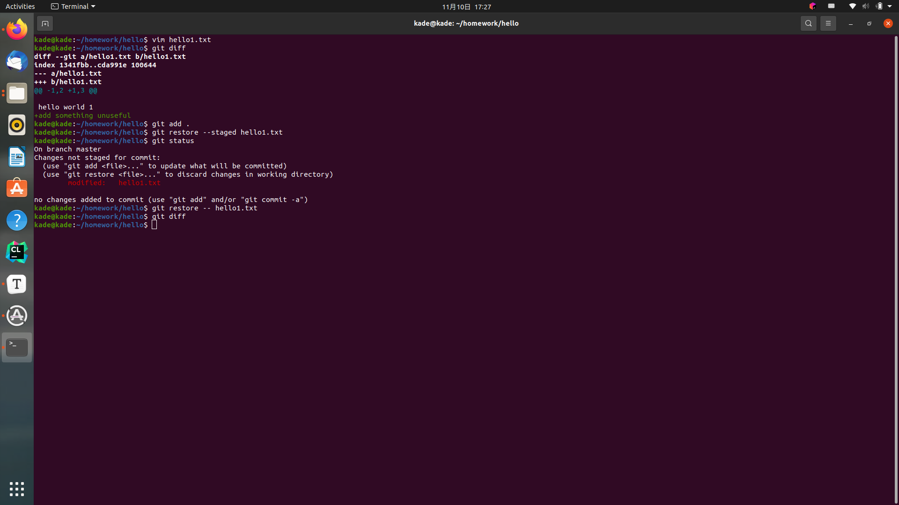
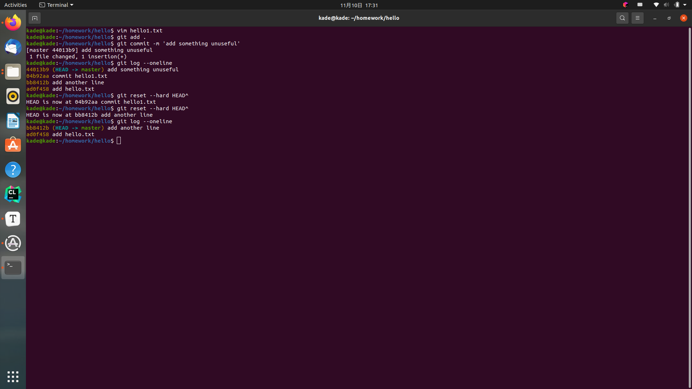
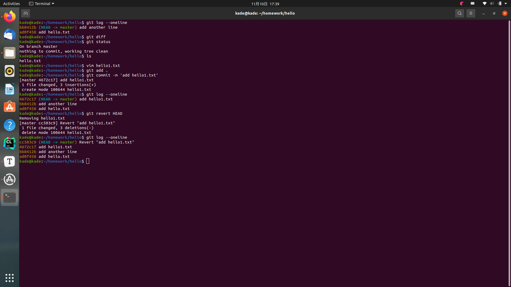
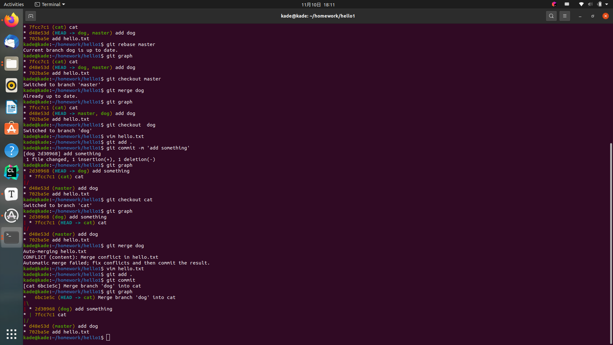
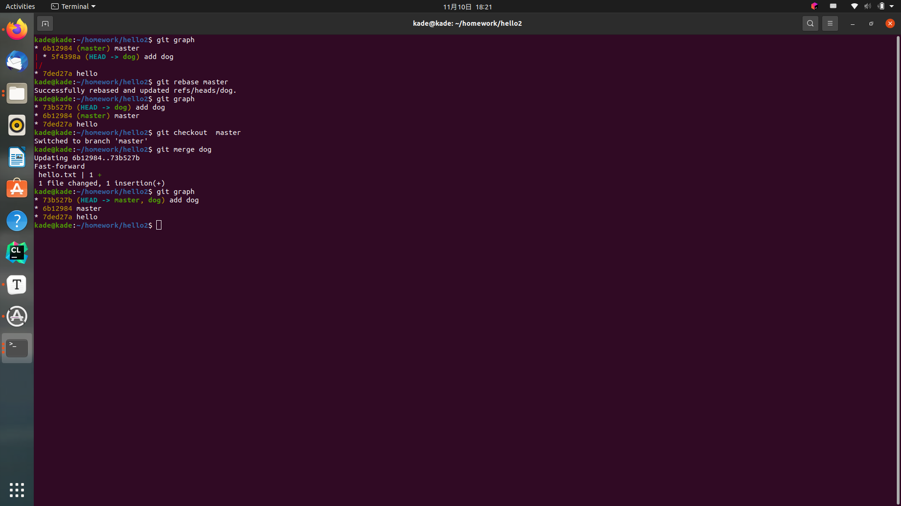

# Application of git 

1. 若你已经修改了部分文件、并且将其中的一部分加入了暂存区，应该如何回退这些修改，恢复到修改前最后一次提交的状态？给出至少两种不同的方式

   第一种

   首先取消暂存的文件

   ```shel
   git reset HEAD <file>
   ```

     然后撤销对文件的修改

   ```shell
   git checkout -- <file>
   ```

   



第二种

```shell
git restore --staged <file>
git restore -- <file>
```



2. 若你已经提交了一个新版本，需要回退该版本，应该如何操作？分别给出不修改历史或修改历史的至少两种不同的方式

   - 篡改历史

   ```shell
   git reset --hard HEAD^
   ```

   

   - 撤回上次提交的内容  ，在产生一个新分支

   ```shell
    git revert HEAD
   ```

   

3.  我们已经知道了合并分支可以使用 merge，但这不是唯一的方法，给出至少两种不同的合并分支的方式

   -  

   ```shell
   git checkout <cat>
   git merge <dog>
   ```

   

   -  

   ```shell
   git checkout dogbrach
   git rebase master
   git checkout master
   git merge dogbranch
   ```

   
