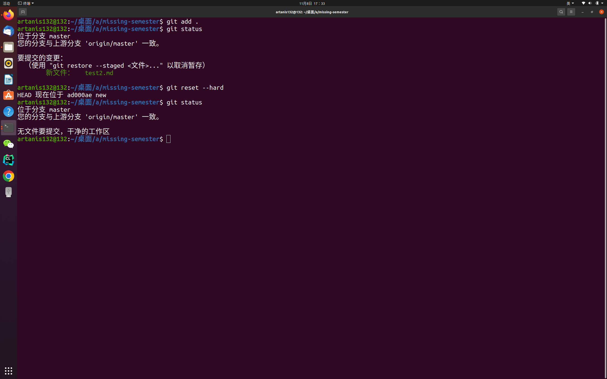
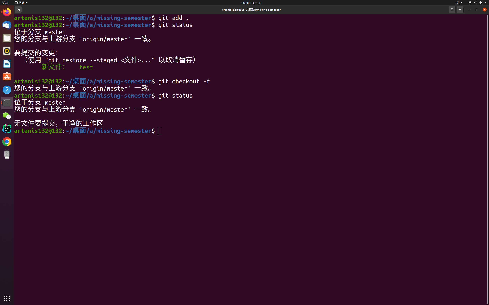
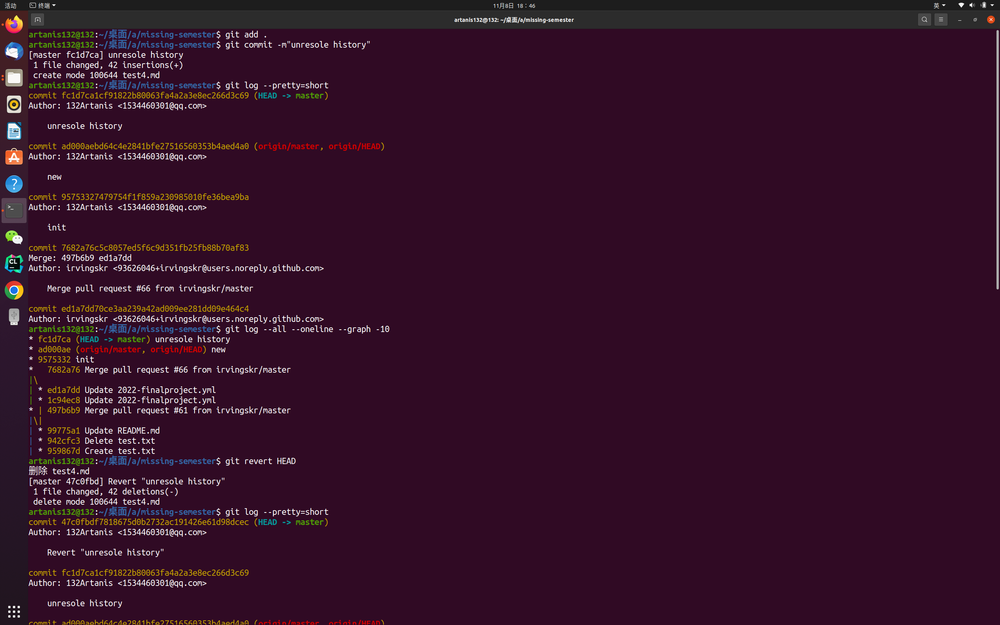
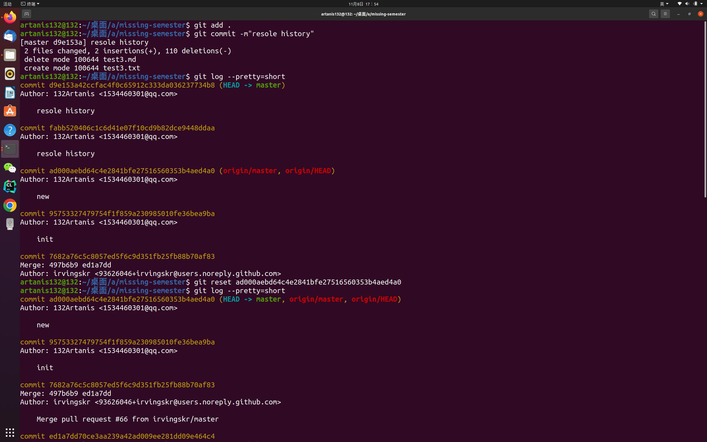
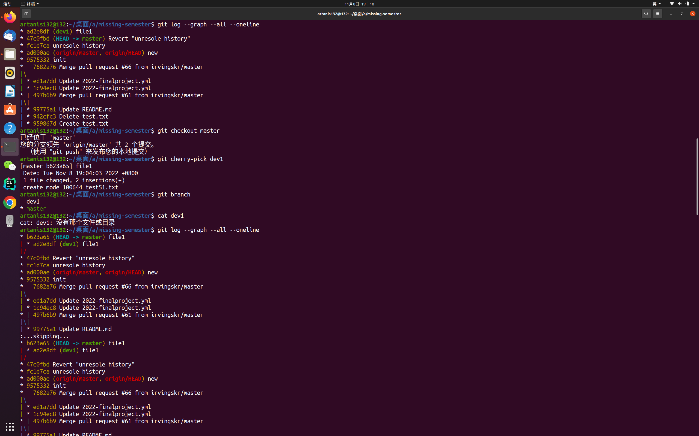
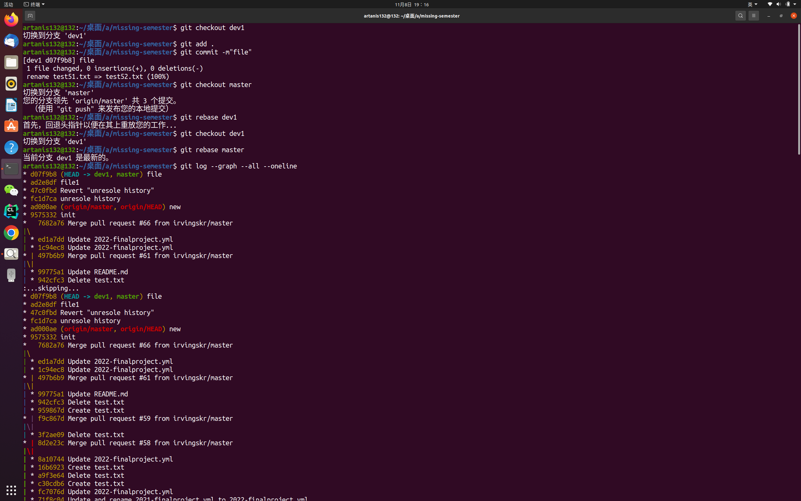

# 问题一

>  若你已经修改了部分文件、并且将其中的一部分加入了暂存区，应该如何回退这些修改，恢复到修改前最后一次提交的状态？给出至少两种不同的方式 :sailboat:

## 回退暂存区解法一

**git reset --hard**

## 回退暂存区解法二

**git checkout -f**

# 问题二

>  若你已经提交了一个新版本，需要回退该版本，应该如何操作？分别给出不修改历史或修改历史的至少两种不同的方式 :airplane:

## 不修改历史解法

**git revert HEAD**

## 修改历史解法

**git reset [版本号]**

# 问题三

>  我们已经知道了合并分支可以使用 merge，但这不是唯一的方法，给出至少两种不同的合并分支的方式 :zzz:

## 分支合并解法一

**git cherry-pick [分支]**

## 分支合并解法二

**git rebase [分支]**

