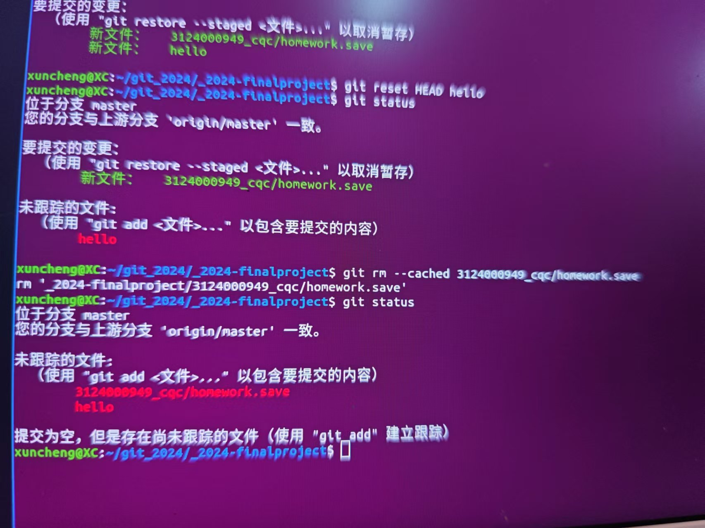
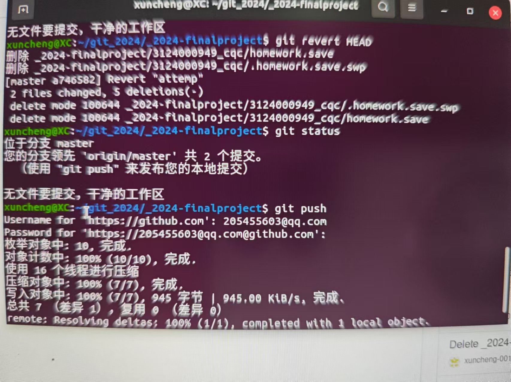
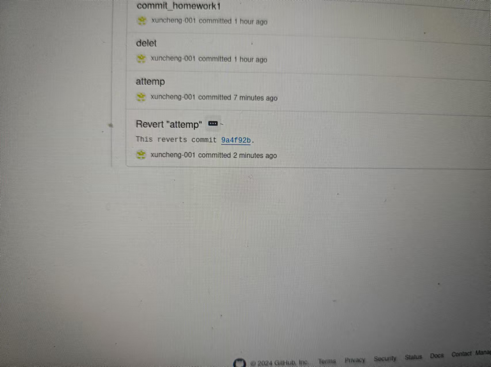
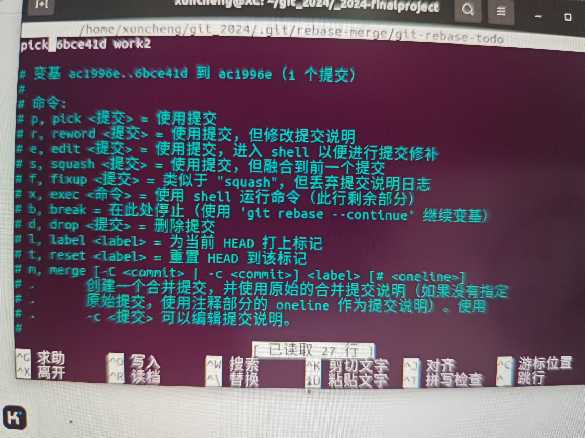
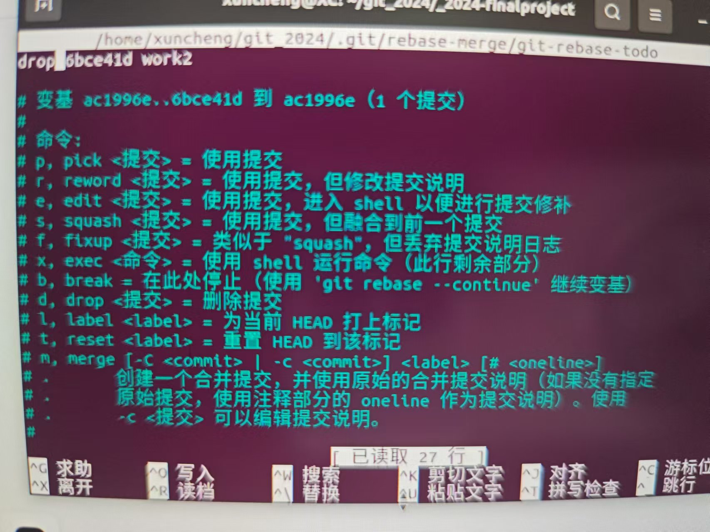
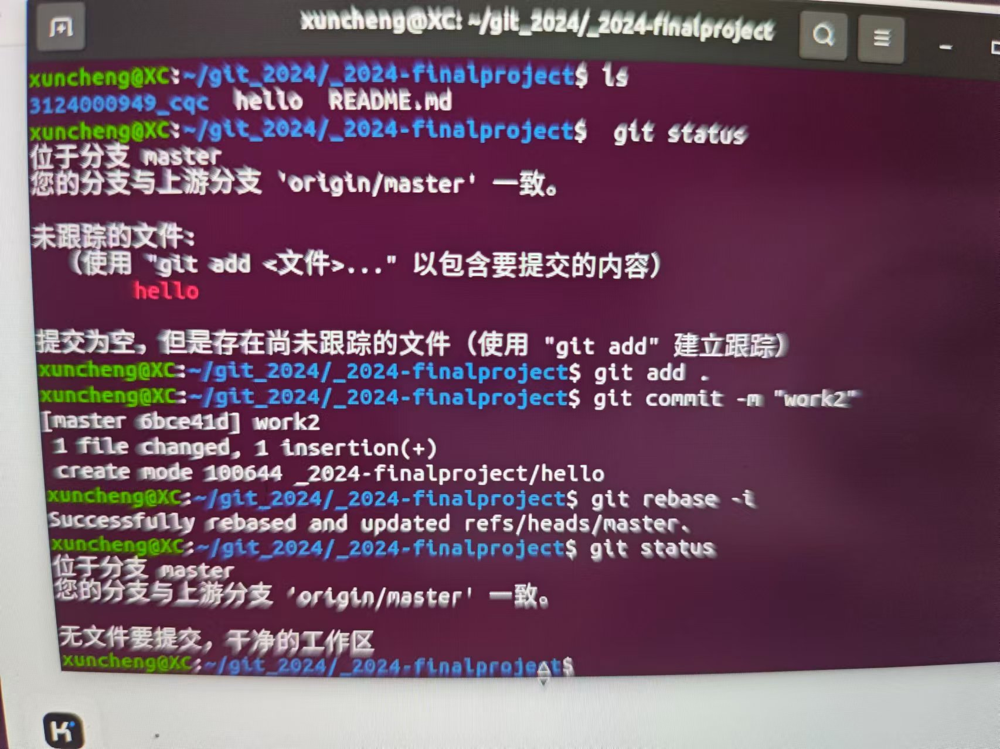
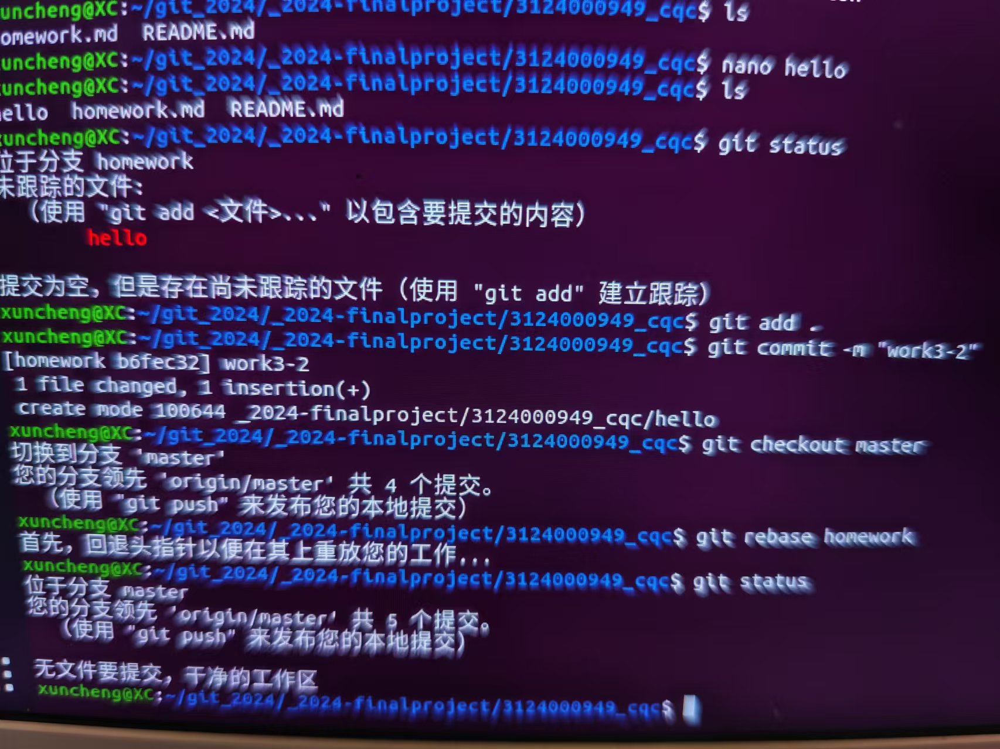

# 若你已经修改了部分文件，并将其中的一部分加入了暂存区，应该如何回退这些修改，恢复到修改前最后一次提交的状态？给出至少两种不同的方式  
  
## 1.可以使用git reset HEAD +文件名称  来取消跟踪
  
## 2.可以使用git rm --cached +文件名称  来取消  
  
  
# 若你已经提交了一个新版本，需要回退该版本，应该如何操作？分别给出不修改历史或修改历史的之后两种不同的方式  
  
## 1.可以使用git revert HEAD 的方式来新建一个提交，提交的内容是取消上一次提交  
  
## 2.也可以使用git rebase -i 来进入一个文档，将想要取消的提交前面的pick 修改成drop就可以了
  
# 我们已经知道了合并分支可以使用merge，但这不是唯一的解决方法，给出至少两种不同的合并分支的办法
  
## 1.使用git cherry-pick +想要合并的分支中的特定提交的哈希名，可以合并特定的提交结果，使用时需要在master分支上
  
## 2.使用git rebase +想要合并的分支名 ，使用这个时需要在master上 

因为做这个作业的时候截图坏掉了，只能拍屏，不好意思。

  

  

  

  

