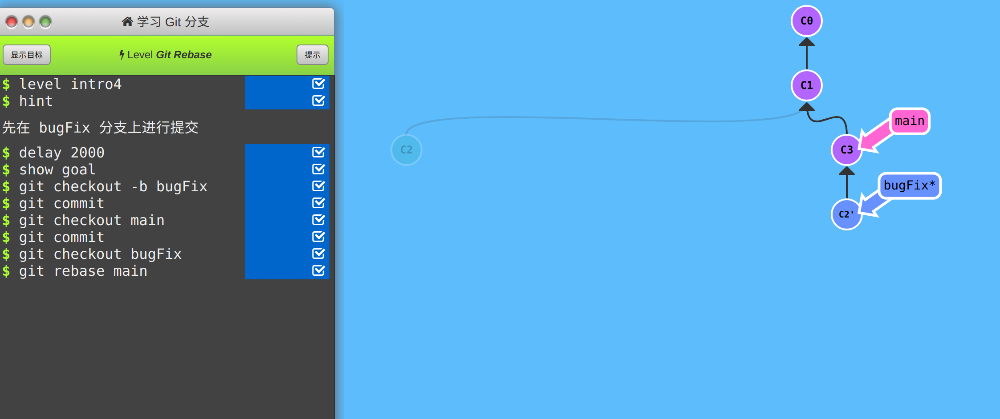
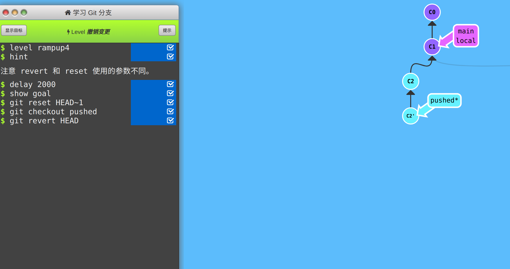
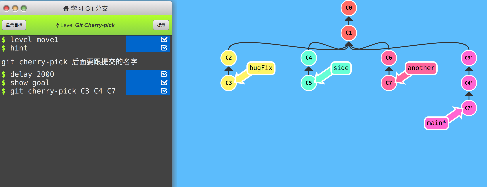

# **引用图片**

<u>一些在learn git branching网站上的学习截图</u>

# **第一题**

**1. **git reset HEAD *<file*>    取消暂存

​    git checkout -- *<file*>     撤销修改

**2.** git restore --staged *<file*>    取消暂存

​    git restore *<*file>      撤销修改

# **第二题**

### *不修改历史*

**1.** git revert HEAD    新提交一个与上一次提交内容一致的记录，可撤回

**2. **git checkout -b *<new-branch*> *<last-branch*>     在需要回退的版本的主支节点上新建一个分支用于回退

**3.** git rebase -i HEAD~2    使用此指令进行交互式rebase并生成一个GUI，将新节点omit而上一个节点保留生成新的分支以实现回退

​                                            ~~（这确实实现了回退并且保留了记录对吧）~~

### *修改历史*

**1.** git reset --hard HEAD~1    强制回退

**2. **git reset --soft HEAD~1    软回退

# **第三题**

设主支为main，分支为branch，初始HEAD指向main

### 方法一

**1.** git checkout branch

**2.** git rebase main    

**3.** git checkout main

**4.** git rebase branch

***由于第四步时branch位于main之后，则main在rebase branch时则实现了合并***

### **方法二**

**1.** git cherry-pick branch

**2.** git rebase branch

***原理与方法一基本相同，而cherry-pick方法简化了步骤实现合并***

~~**方法三**   使用交互式rebase~~

