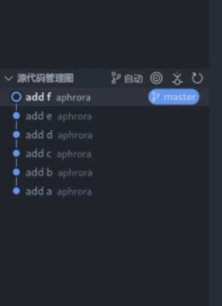

#### 1.若你已经修改了部分文件、并且将其中的一部分加入了暂存区，应该如何回退这些修改，恢复到修改前最后一次提交的状态？给出至少两种不同的方式

##### git reset \<filename\>

##### git rm --cached \<filename\>

```
aphrora@localhost:~/DynamicX/tmp> touch a.txt
aphrora@localhost:~/DynamicX/tmp> git init
aphrora@localhost:~/DynamicX/tmp> git add a.txt
aphrora@localhost:~/DynamicX/tmp> git ls-files
a.txt
aphrora@localhost:~/DynamicX/tmp> git reset
aphrora@localhost:~/DynamicX/tmp> git ls-files
aphrora@localhost:~/DynamicX/tmp>
```

#### 2.若你已经提交了一个新版本，需要回退该版本，应该如何操作？分别给出不修改历史或修改历史的至少两种不同的方式

##### git revert \<commit-hash\> #不修改历史

```aphrora@localhost:~/DynamicX> git add a.txt
aphrora@localhost:~/DynamicX> git commit -m "add a.txt"
[master (root-commit) 065bd76] add a.txt
 1 file changed, 1 insertion(+)
 create mode 100644 a.txt
aphrora@localhost:~/DynamicX> git log | cat
commit 065bd76d83d810342e245d0bc48bb358f0832b31
Author: aphrora <108052453@qq.com>
Date:   Wed Nov 6 10:54:26 2024 +0800

    add a.txt
aphrora@localhost:~/DynamicX> git revert 065bd76d83d810342e245d0bc48bb358f0832b31
[master 408fee4] Revert "add a.txt"
 1 file changed, 1 deletion(-)
 delete mode 100644 a.txt
aphrora@localhost:~/DynamicX>
```

##### git reset --hard \<commit-hash\> #修改历史

###### # 硬重置到指定提交，丢失所有后续提交

```
aphrora@localhost:~/DynamicX/tmp> git commit -m "add a.txt"
[master (root-commit) 9af55e5] add a.txt
 1 file changed, 0 insertions(+), 0 deletions(-)
 create mode 100644 a.txt
aphrora@localhost:~/DynamicX/tmp> git log | cat
commit 9af55e5eaf33160f5dd7f7abf751678513b17c79
Author: aphrora <108052453@qq.com>
Date:   Wed Nov 6 10:59:24 2024 +0800

    add a.txt
aphrora@localhost:~/DynamicX/tmp> git reset --hard 9af55e5eaf33160f5dd7f7abf751678513b17c79
HEAD is now at 9af55e5 add a.txt
```

##### git rebase -i HEAD~n #修改历史

#### 3.我们已经知道了合并分支可以使用 merge，但这不是唯一的方法，给出至少两种不同的合并分支的方式

##### git rebase

```
aphrora@localhost:~/DynamicX/tmp> git checkout newb
aphrora@localhost:~/DynamicX/tmp> echo "haha" >> h
aphrora@localhost:~/DynamicX/tmp> git add h
aphrora@localhost:~/DynamicX/tmp> git commit -m "modify h"
[newb af84c0e] modify h
 1 file changed, 1 insertion(+)
aphrora@localhost:~/DynamicX/tmp> git rebase master
Current branch newb is up to date.
aphrora@localhost:~/DynamicX/tmp>
```

##### git cherry-pick

```
aphrora@localhost:~/DynamicX/tmp> echo "why" >>f
aphrora@localhost:~/DynamicX/tmp> git add f
aphrora@localhost:~/DynamicX/tmp> git commit -m "add why"
[newb a3b4aa8] add why
 1 file changed, 1 insertion(+)
aphrora@localhost:~/DynamicX/tmp>  git checkout master
Switched to branch 'master'
aphrora@localhost:~/DynamicX/tmp> echo "omg" >> f
aphrora@localhost:~/DynamicX/tmp> git add f
aphrora@localhost:~/DynamicX/tmp> git commit -m "add omg"
[master e31b176] add omg
 1 file changed, 1 insertion(+)
aphrora@localhost:~/DynamicX/tmp> git cherry-pick newb
Auto-merging f
CONFLICT (content): Merge conflict in f
error: could not apply a3b4aa8... add why
hint: After resolving the conflicts, mark them with
hint: "git add/rm <pathspec>", then run
hint: "git cherry-pick --continue".
hint: You can instead skip this commit with "git cherry-pick --skip".
hint: To abort and get back to the state before "git cherry-pick",
hint: run "git cherry-pick --abort".
aphrora@localhost:~/DynamicX/tmp> vim f #resolve conflict
aphrora@localhost:~/DynamicX/tmp> git add f
aphrora@localhost:~/DynamicX/tmp> git cherry-pick --continue
[master 7307431] add why
 Date: Wed Nov 6 15:21:45 2024 +0800
 1 file changed, 1 insertion(+)
aphrora@localhost:~/DynamicX/tmp>

```


