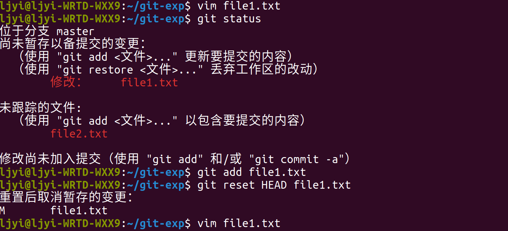
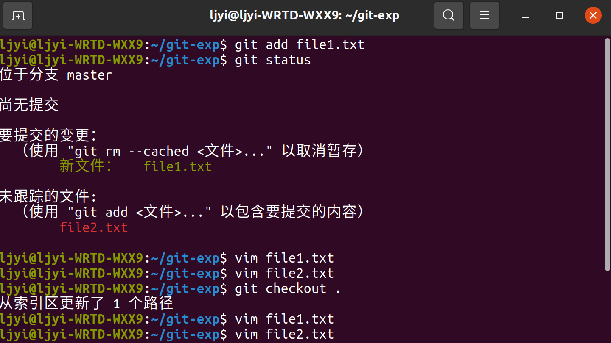
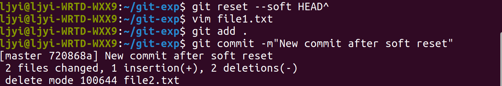
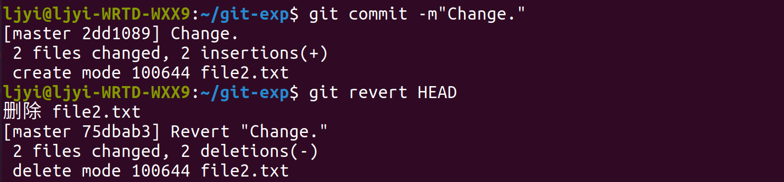
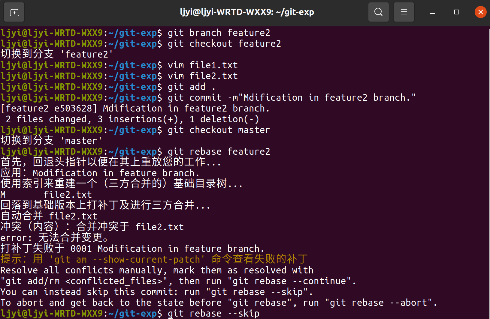

# git 应用
###### Q1:若你已经修改了部分文件,并且将其中的一部分加入了暂存区，应该如何回退这些修改,恢复到修改前最后一次提交的状态？给出至少两种不同的方式
方式1：使用 git reset --hard 命令 
方式2：使用 git checkout 命令 
###### Q2:若你已经提交了一个新版本，需要回退该版本，应该如何操作？分别给出不修改历史或修改历史的至少两种不同的方式
方式1（不修改历史）：使用  git reset --soft  命令
方式2（不修改历史）：使用  git revert  命令  
方式3（修改历史）：使用  git reset --hard  命令 
###### Q3：我们已经知道了合并分支可以使用merge，但这不是唯一的方法，给出至少两种不同的合并分支的方式
方式1：使用  git merge  命令(题目给的也算个方式吧hhh) 
方式2：使用  git rebase  命令(这边浅浅skip当逃兵了，file2要合并的话得解决冲突） 
