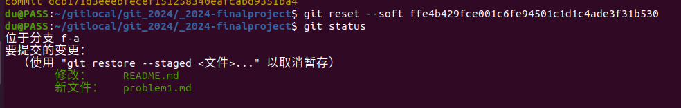
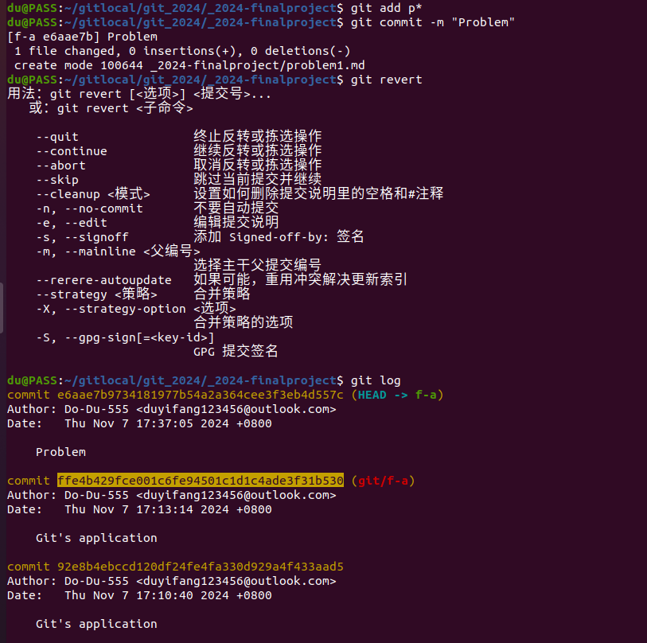
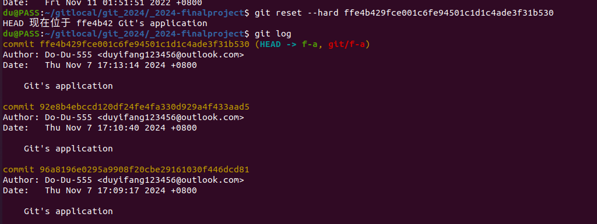
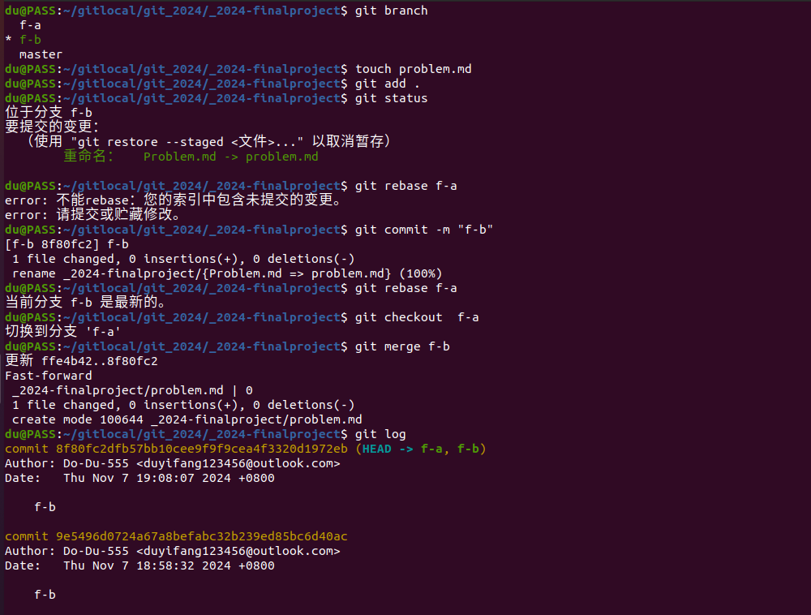
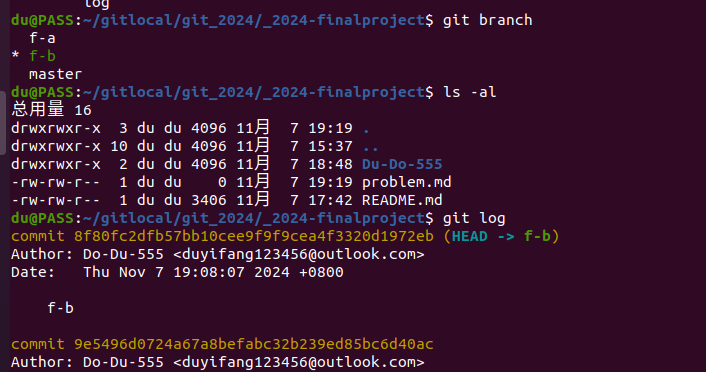
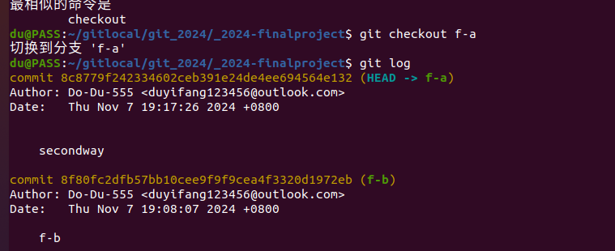
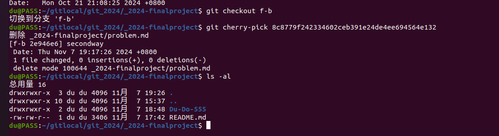

# ***Git应用***
## **问题一**
**1.** 可以用git restore --staged <文件名>来取消该文件的缓存；

**2.** 可以用git reset -sofe <commit_id>来回退删除缓存；

## **问题二**
**1.** 可以用git reset -sofe <commit_id>修改历史来回退版本；

## **问题三**
**1.** 可以用git rebase先将修改内容合并到另一个分支的末尾，在另一个分支中用merge合并可以避免冲突；

**2.** 可以用git cherry-pick <commit_id>来将别的分支的修改添加到现分支中，实现合并的效果。

