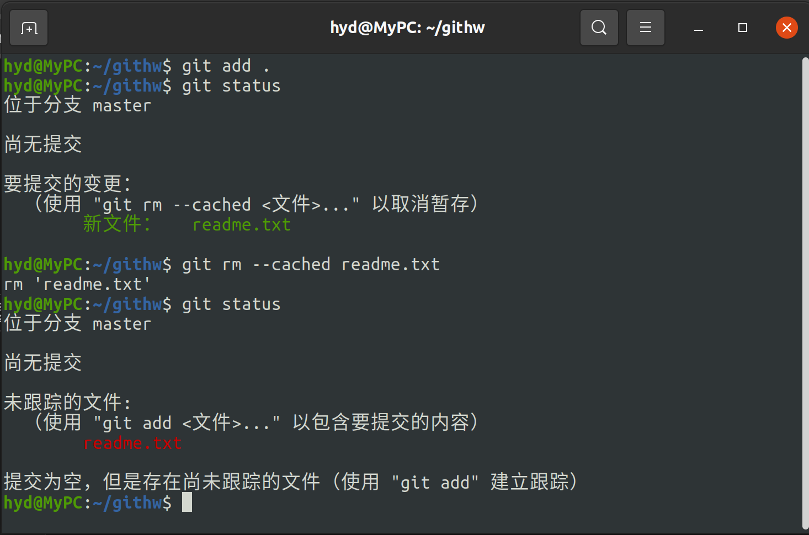
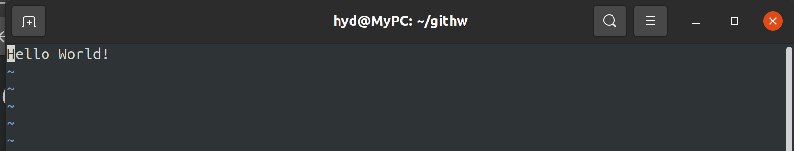

# Git Homework-By ZhongZhipeng

## Task 1:"若你已经修改了部分文件、并且将其中的一部分加入了暂存区，应该如何回退这些修改，恢复到修改前最后一次提交的状态？给出至少两种不同的方式"

### Solutions:

#### Solution 1

使用

```bash
$ git reset
```


#### Solution 2

使用

```bash
$ git rm --cached <file>
```



## Task 2:"若你已经提交了一个新版本，需要回退该版本，应该如何操作？分别给出不修改历史或修改历史的至少两种不同的方式"

### Solutions

#### Solution 1.1（修改历史）:

使用如下命令进行回退

```bash
$ git reset --hard <commit_hash>^
```


先在`~/githw`中创建一个`reademe.txt`文件，插入文本如图所示，作为第一个版本


将其`commit`后修改，在文本末添加语句如图


同样地，将其作为修改后的版本2并`commit`，此时log如图


这时，使用

```bash
$ git reset --hard HEAD^
```

一个幂指符号^表示上一版本，两个则表示上两个版本

此时可以看到版本已切回Version 1，打印readme.txt的内容，显示为第上版本的


查看此时的log


说明该方法为修改历史的一种方式


#### Solution 1.2（修改历史）：

使用如下命令

```bash
$ git rebase -i <commit_hash>^
```

同Solution1.1编辑并修改reademe.txt


对修改后的文件commit


执行命令

```bash
$ git rebase -i HEAD^
```

并修改弹出的文件（将pick改为drop）


保存并退出


显示版本已回退



#### Solution 2.1（不修改历史）：

使用如下命令

```bash
$ git reset --soft HEAD
```

修改Solution 1中的readme.txt文件并commit


此时使用

```bash
$ git reset --soft HEAD
```

可以发现commit已被回退至暂存区


查看文件内容


文件内容并未改变


#### Solution 2.2

使用

```bash
$ git revert HEAD
```

撤销提交

对readme.txt的操作同以上三种方法，在此省略展示

执行该命令


撤回了上一个版本的提交


## Task 3 :"我们已经知道了合并分支可以使用 merge，但这不是唯一的方法，给出至少两种不同的合并分支的方式"

### Solutions

#### Solution 1

使用

```bash
$ git rebase
```


如图，我将一个内容为空的readme.txt文件commit到了master分支，随后切换到feature分支并往readme.txt添加字符（对文件进行修改），随后commit

然后切换到master分支并使用上述命令


打开文件，文件内容证实已进行分支合并


#### Solution 2

```bash
$ git cherry-pick <commit_hash>
```

同Solution 1操作，陈述在此省略

执行上述操作，结果如图


打开文件，结果如图，说明分支成功合并


