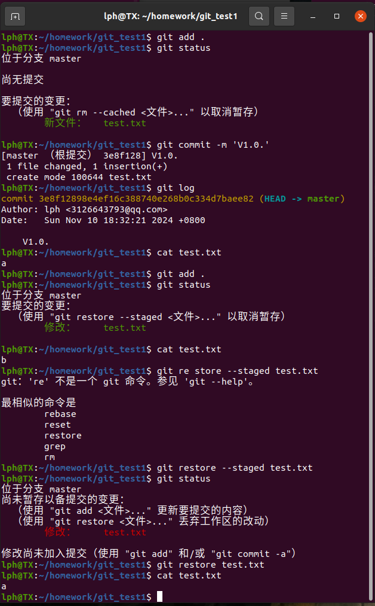
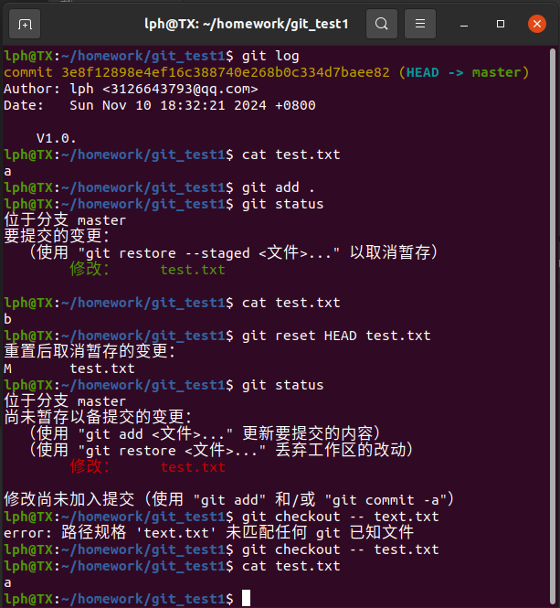
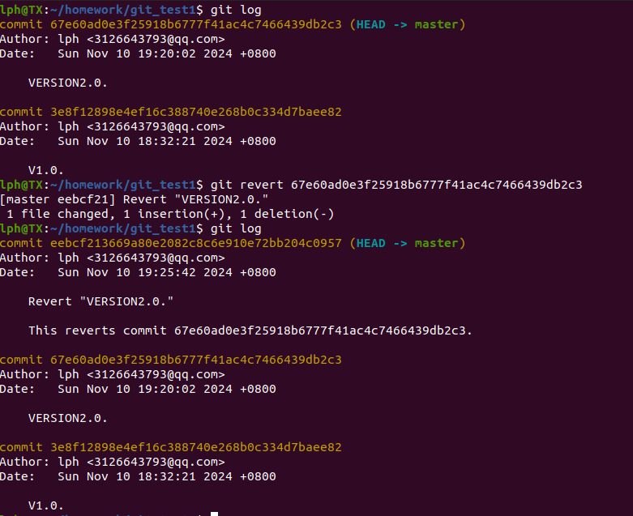
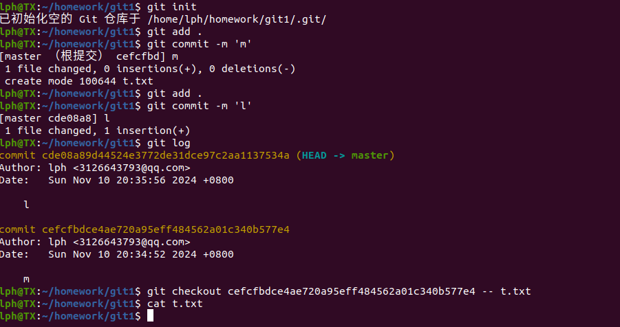
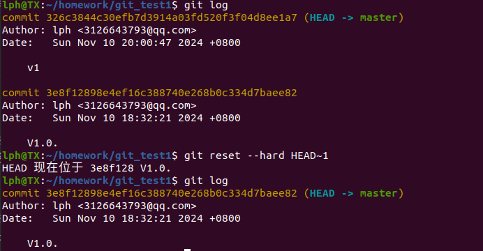
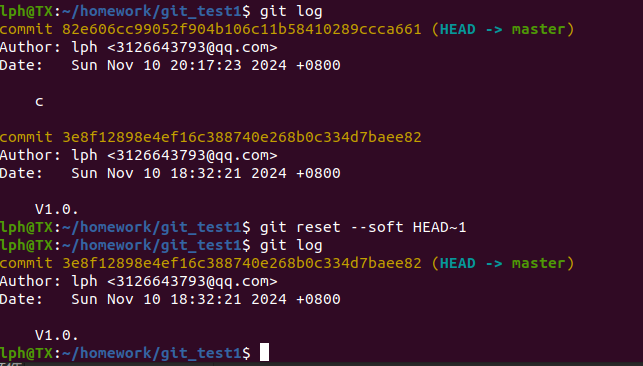
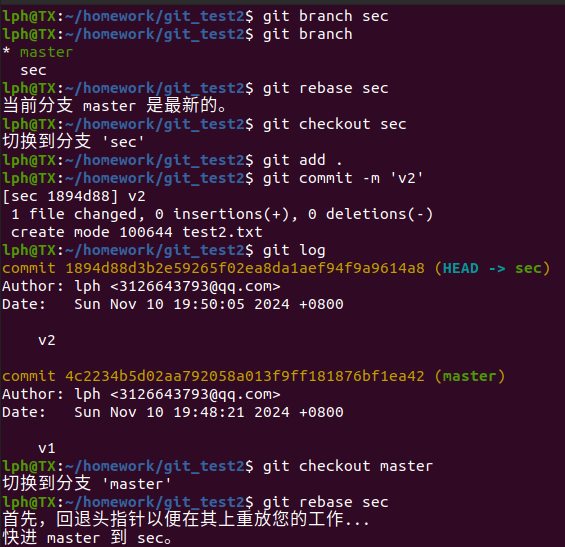
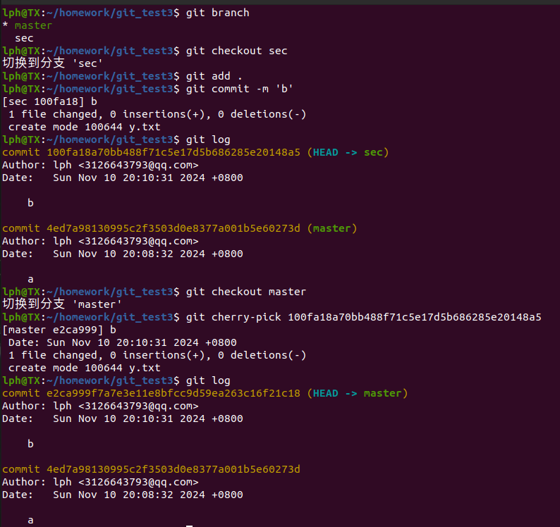

## Q1

### 方法一使用 git restore

```
git restore <file_name># 回退未暂存的更改
git restore --staged <file_name># 回退已暂存的更改
```

效果图：



### 方法二：使用 git checkout

```
git checkout -- <file_name># 回退未暂存的更改

git reset HEAD <file_name>
git checkout -- <file_name># 回退已暂存的更改
```



---

## Q2

### 方法一：不修改历史git revert

```
git revert <commit># 回退上一个提交
```

效果图：



```
git checkout <commit> -- <path>#针对一个文件
```



t.txt 文件本来就是空的，在第二次提交时t.txt被修改过，最后回退后变回空文件

### 方法二：修改历史git reset

```
git reset --soft HEAD# 使用--soft保留更改，移回到上一个提交

git reset --hard HEAD# 使用--hard删除提交和更改
```

效果图：





---

## Q3

### 方法一：使用 rebase

```
git checkout <branch1># 切换到要合并到的分支

git rebase <branch2># 将branch2分支的提交重放到branch1上
```

效果图:



### 方法二：使用 cherry-pick

```
git checkout main
git cherry-pick <commit-hash>
```


