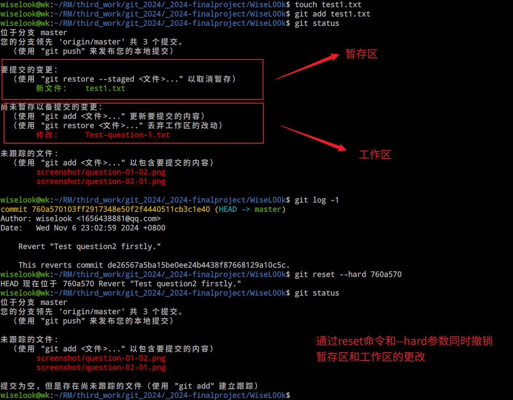
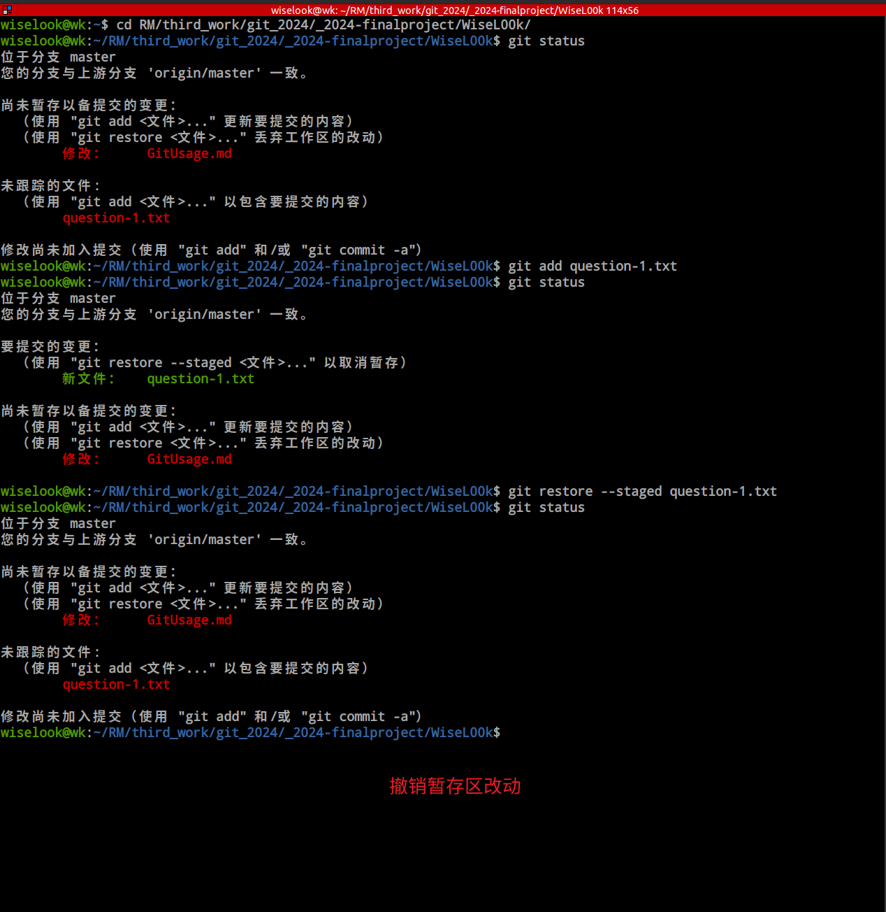
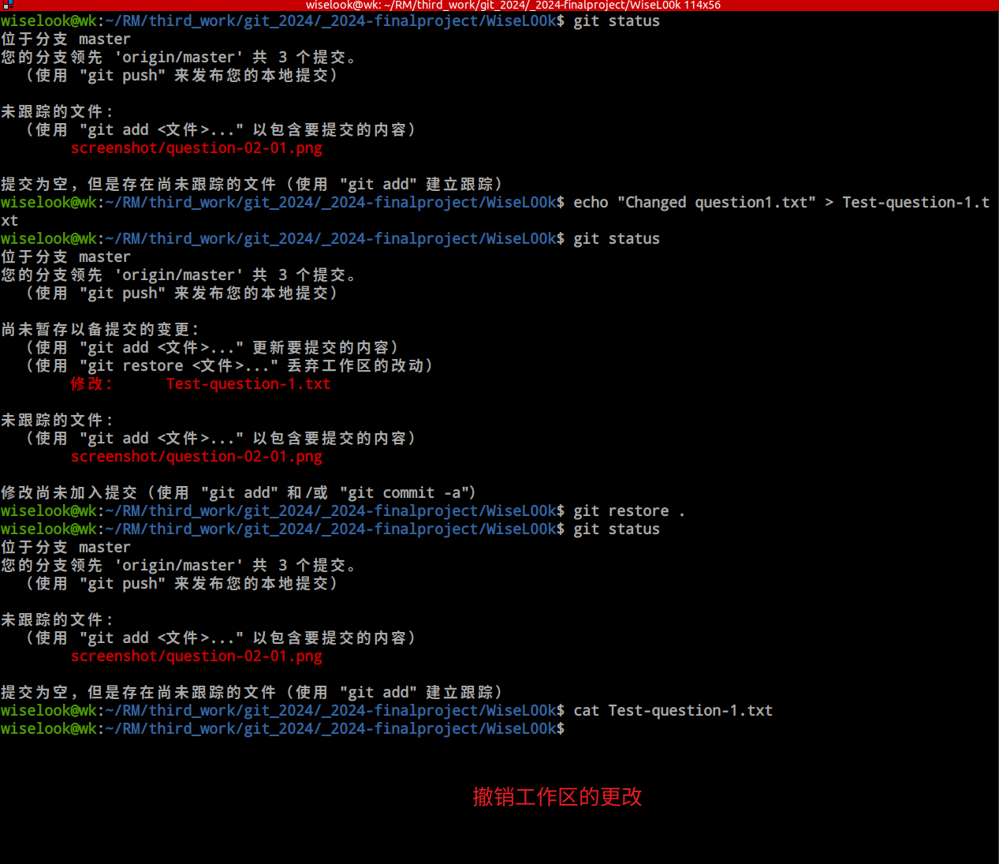
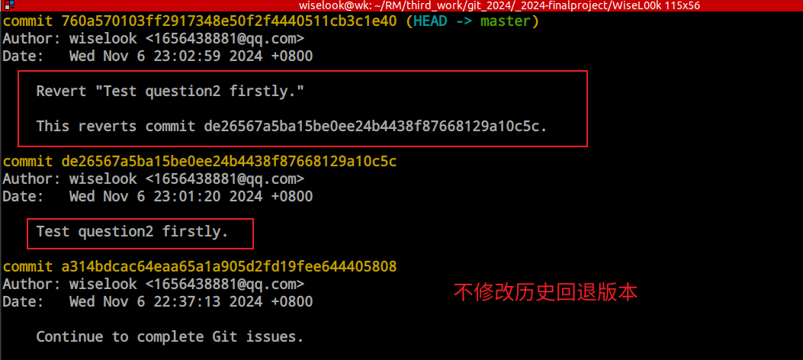
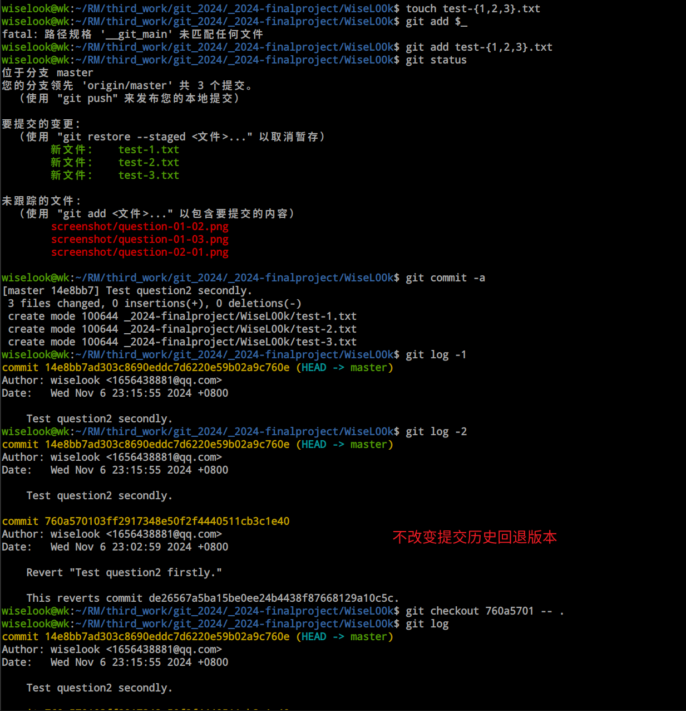
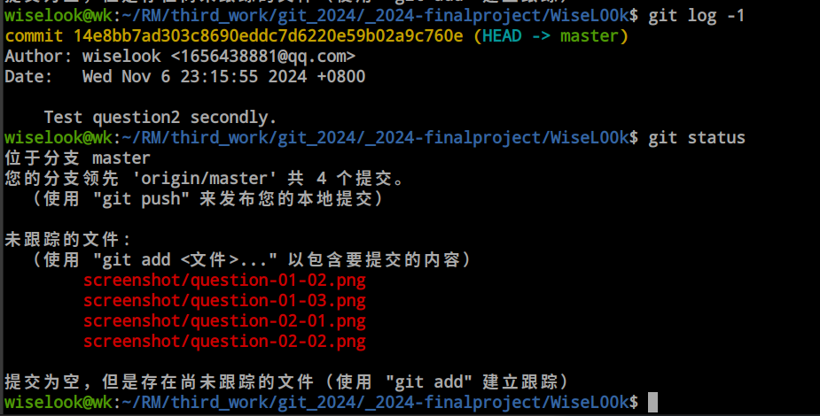
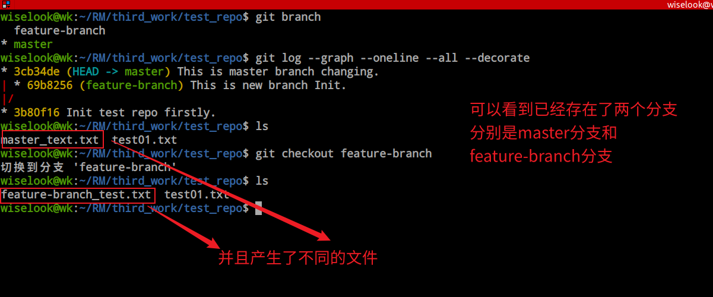
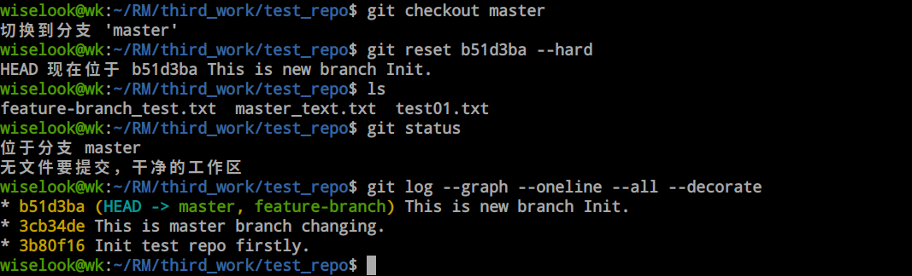

# Git应用

## 问题1

#### 1.若你已经修改了部分文件、并且将其中的一部分加入了暂存区，应该如何回退这些修改，恢复到修改前最后一次提交的状态？给出至少两种不同的方式

答：

1.可以使用 git reset --hard  \<commit\> 命令，其中commit版本号，可以通过 git log 命令查看。通过--hard参数，暂存区和工作区都将重置。commit用HEAD就行，因为还没有提交。此时HEAD指向的便是最新一次提交，即最后一次提交。



2.也可以执行 git restore --staged \<file1> 命令，撤回暂存区的更改。然后执行git restore . ,撤销所有工作区更改。

***PS：通过	.	符号通常都是指所有文件。***





3.另外还可以使用 git checkout \<commit\> -- file1... , 将file1替换为要回退的文件即可。这样工作区便恢复成最后一次提交的状态。此外使用 git checkout -- .  可以恢复文件到最后一次提交时的状态，包括工作区和暂存区的修改都会被撤销。

## 问题2

#### 2.若你已经提交了一个新版本，需要回退该版本，应该如何操作？分别给出不修改历史或修改历史的至少两种不同的方式

答：

1-1.若要不修改历史，可以通过git revert命令，这条命令会创建一个新的提交，这个提交会撤销之前提交的内容。这样，历史记录仍然保持不变，只是增加了一个撤销提交。通过执行下面命令，便可以不修改历史回退版本。

```
git revert <新版本前一个版本的哈希值>
```



1-2.还可以使用 git checkout 命令，通过 git checkout <新版本前一个版本的哈希值> -- . ,也可以实现不修改历史回退版本。<新版本前一个版本的哈希值>可以通过git log查看





2-1.对于修改历史的回退版本的方法，可以使用 

```
git reset --hard <上一个版本哈希值>
```

便可以实现修改历史的回退版本方法，这会删除这个版本之后的所有commit信息。实现修改历史的效果。效果图片可参考问题1中的第一张配图。

2-2.此外，我们还可以使用

```
git rebase -i
```

这条命令被称为**交互式变基**。通过这条命令，可以选择性地修改提交历史。

## 问题3

#### 3.我们已经知道了合并分支可以使用 merge，但这不是唯一的方法，给出至少两种不同的合并分支的方式



答：1-1.我们可以使用下面两条命令，实现合并分支的方式

```
git checkout feature-branch
git rebase master
```

上面两条命令的含义如下：

首先将当前HEAD指针切换到feature-branch分支，随后通过rebase变基命令，featurn-branch分支会将master分支的最新提交作为基底，实现变基操作，从而达到合并效果。而在提交历史上看，是线性的。因为这里**变基**了！变基后，执行reset命令，附带--hard参数，从而使master分支位于最新提交。




***PS：因为作业要求 修改历史必须线性，也就是不能出现分支。为避免误操作，导致不符合作业要求。故没有在本仓库进行测试命令，而是另开仓库进行测试。***

1-2.除了rebase，还可以使用cherry-pick合并指定提交。

```
git checkout master
git cherry-pick <commit-hash>
```

这两条命令分别实现了如下操作：

首先将当前分支切换为master分支，而后通过cherry-pick选择一个想要合并的提交合并到master分支。使用方法大致可参考题目3中配图。


> 参考资料：[Git教程|菜鸟教程](https://www.runoob.com/git/git-tutorial.html)