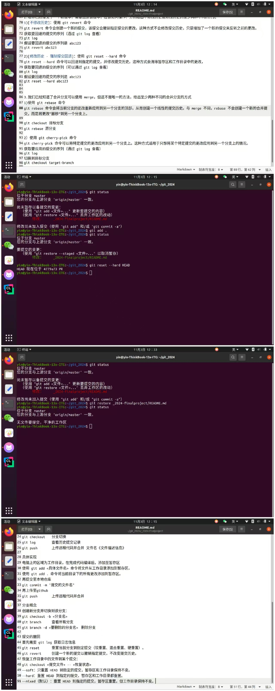
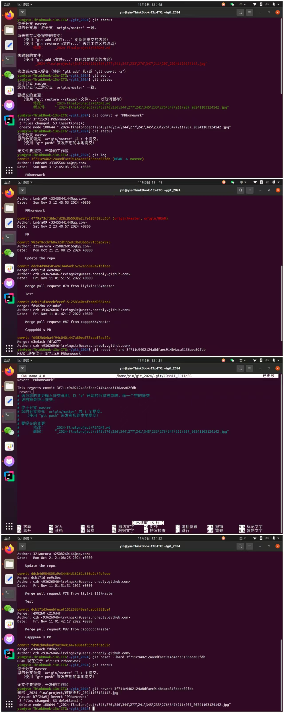

git 学习总结
1.连接github
配置个人的用户名称和电子邮件地址，：
git config --global user.name "用户名"
git config --global user.email 邮箱
生成ssh
ssh-keygen -t rsa -b 4096 -C "github"
将ssh添加到github中
更改配置文件修改端口 port 443
测试ssh连接 
ssh -T -p 443 git@github.com

git操作
git init	初始化仓库
git add	添加文件到暂存区
git commit	将暂存区内容添加到仓库中
git add	添加文件到暂存区
git status	查看仓库当前的状态，显示有变更的文件
git diff	比较文件的不同，即暂存区和工作区的差异
git reset	回退版本
git rm		将文件从暂存区和工作区中删除
git mv		移动或重命名工作区文件
git checkout	分支切换
git log	查看历史提交记录
git push	上传远程代码并合并 文件名《文件描述信息》

具体实现
电脑上的区域为工作目录，在完成代码编译后，添加至暂存区
使用 git add <具体文件名> 命令将文件从工作目录添加到暂存区。
使用 git add . 命令将当前目录下的所有更改添加到暂存区。
再提交至本地仓库
git commit -m "文件信息描述（English.）"
再上传至github
git push	上传远程代码并合并

分支概念
创建新分支并切换到该分支：
git checkout -b <分支名>
git branch	查看所有分支
git branch -d <要删除的分支名>	删除分支

提交的撤回
首先需要 git log 获取日志信息
git reset	重置当前分支到指定提交（软重置、混合重置、硬重置）。
git revert	创建一个新的提交以撤销指定提交，不改变提交历史。
恢复工作目录中的文件到某个提交：
git checkout <提交文件> -- <恢复状态>
--soft：只重置 HEAD 到指定的提交，暂存区和工作目录保持不变。
--hard：重置 HEAD 到指定的提交，暂存区和工作目录都重置。
--mixed（默认）：重置 HEAD 到指定的提交，暂存区重置，但工作目录保持不变。

1.若你已经修改了部分文件、并且将其中的一部分加入了暂存区，应该如何回退这些修改，恢复到修改前最后一次提交的状态？给出至少两种不同的方式
1)使用 git reset --hard 命令
git reset --hard 命令会将工作目录中的文件回退到最近一次提交的状态，并清除暂存区中的所有更改。
git reset --hard HEAD
2)使用 "git restore --staged <文件>..." 以取消暂存
使用 "git restore <文件>..." 丢弃工作区的改动
3)使用 git checkout -- 命令（针对特定文件）
git checkout -- 命令可以将特定文件恢复到最近一次提交的状态，但不会影响暂存区中的其他文件。
git checkout -- <文件路径>

2.若你已经提交了一个新版本，需要回退该版本，应该如何操作？分别给出不修改历史或修改历史的至少两种不同的方式
1)[不修改历史]：使用 git revert 命令
git revert 命令会创建一个新的提交，该提交会撤销指定提交的更改。这种方式不会修改提交历史，只是增加了一个新的提交来反转之前的更改。
获取要回退的提交的序列（通过 git log 查看）
git log
假设要回退的提交的序列是 abc123
git revert abc123

2)[修改历史 - 强制提交回退]：使用 git reset --hard 命令
git reset --hard 命令可以回退到指定的提交，并修改提交历史。这种方式会清除暂存区和工作目录中的更改，
获取要回退的提交的序列（可以通过 git log 查看）
git log 
假设要回退的提交的序列是 abc123
git reset --hard abc123

3.我们已经知道了合并分支可以使用 merge，但这不是唯一的方法，给出至少两种不同的合并分支的方式
1)使用 git rebase 命令
git rebase 命令会将当前分支的更改重新应用到另一个分支的顶部，从而创建一个线性的提交历史。与 merge 不同，rebase 不会创建一个新的合并提交，而是将更改“搬移”到另一个分支上。

git checkout 目标分支
git rebase 源分支

2）使用 git cherry-pick 命令
git cherry-pick 命令可以将特定提交的更改应用到另一个分支上。这种方式适用于只想将某个特定提交的更改应用到另一个分支上的情况。
获取要应用的提交的序列（通过 git log 查看）
git log
切换到目标分支
git checkout target-branch

假设要应用的提交的序列是 abc123
git cherry-pick abc123

注意事项
1.开pr的标题不用句号
2.commit信息带句号(英文)
3.句首字母要大写

修改文件夹名
