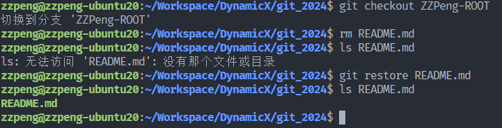
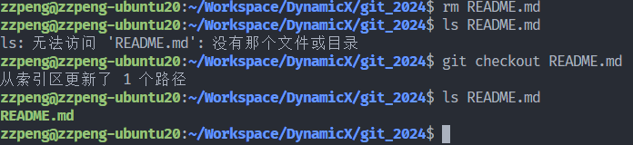
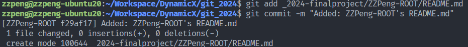
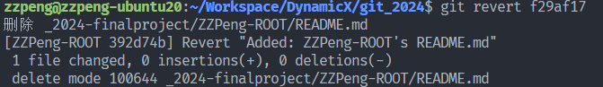
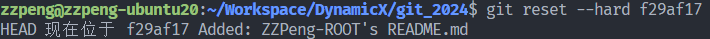
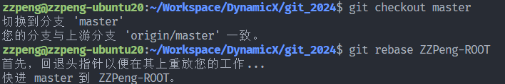
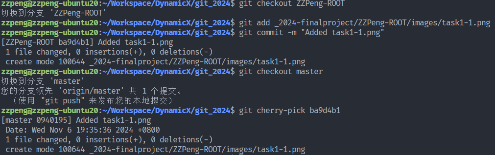
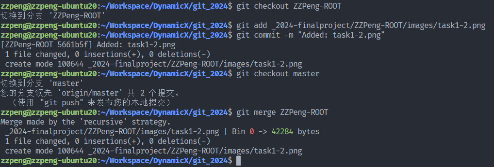

# Final Project

## 回退修改

1. 使用```restore```命令

   

2. 使用```checkout```命令

   

## 回退版本

假设我们已经提交的**bd5f5c**是我们想要撤回的



1. 使用```revert```命令

   

2. 使用```reset```命令

   

> [!NOTE]
>
> 需要注意的是:
>
> ```revert```会新建一个提交将之前的操作反转过来
> ```reset```则是直接将之前的提交丢弃掉
>
> ```revert```适用于之前的提交已经push的情况，```reset```适用于之前的提交还在本地，当然本地也可以使用```revert```

## 合并分支

1. 使用```rebase```命令

   

2. 使用```cherry-pick```命令

   

3. 当然，最常用的还是```merge```命令

   
