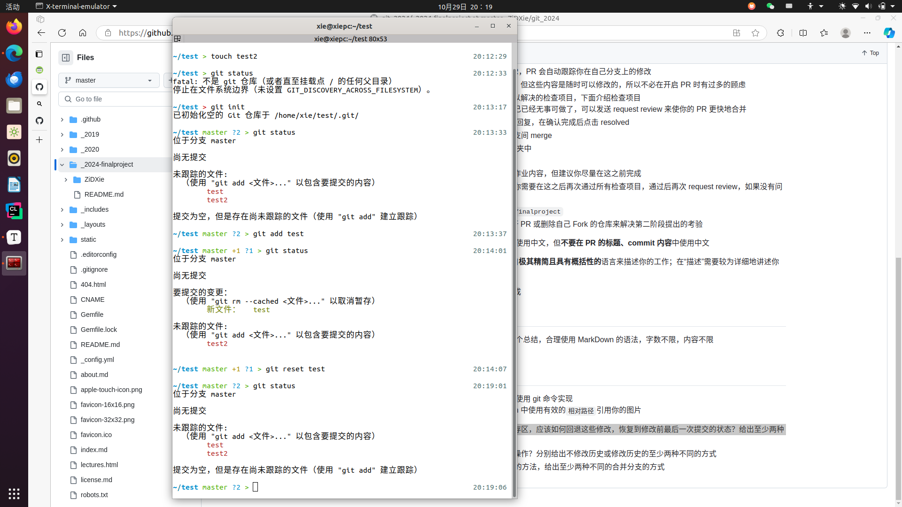
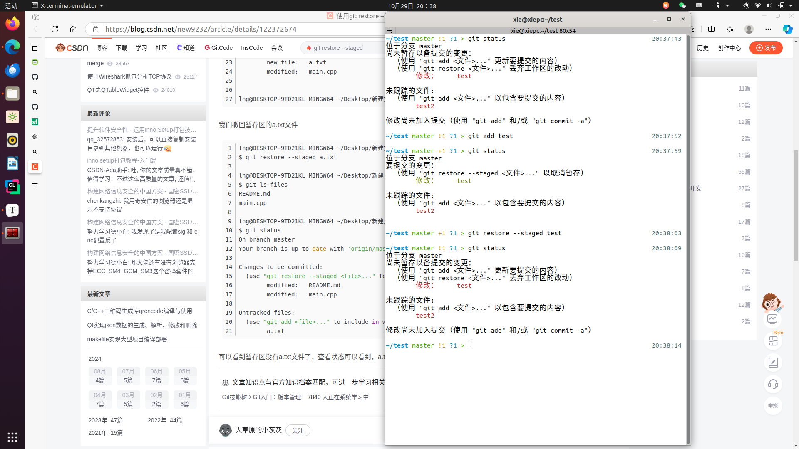
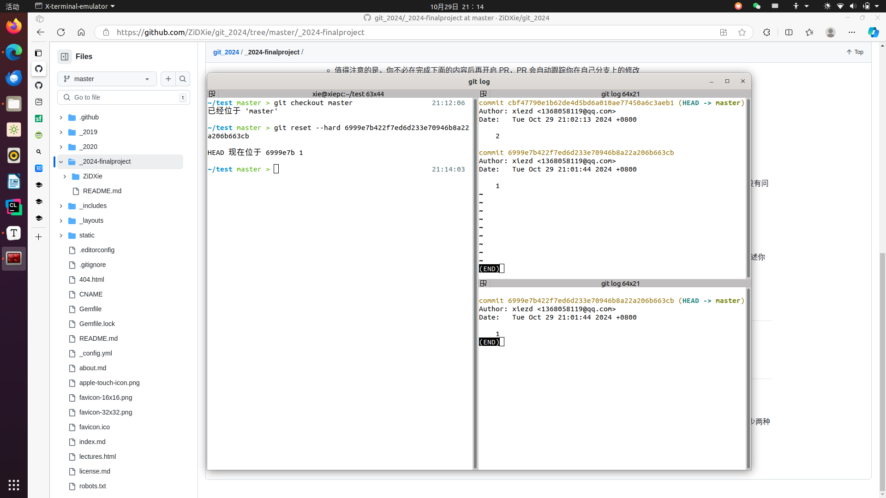
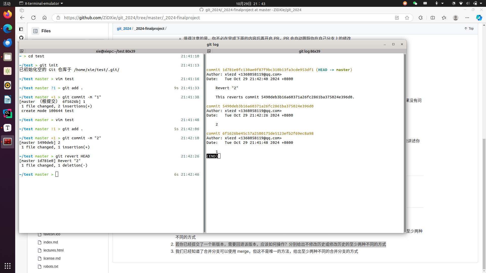
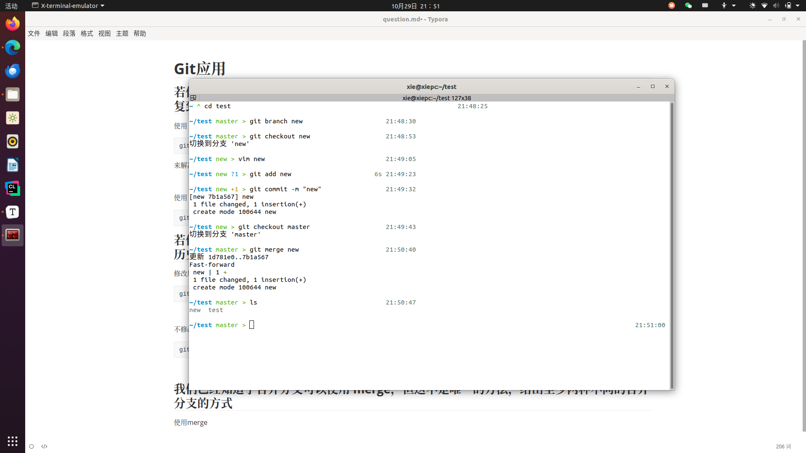
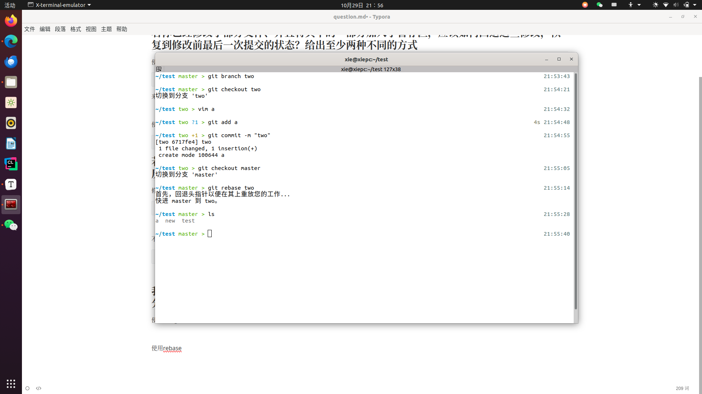

# Git应用

## 若你已经修改了部分文件、并且将其中的一部分加入了暂存区，应该如何回退这些修改，恢复到修改前最后一次提交的状态？给出至少两种不同的方式

使用

```
git reset filename
```

来解决问题



使用

```
git restore --staged test  
```



## 若你已经提交了一个新版本，需要回退该版本，应该如何操作？分别给出不修改历史或修改历史的至少两种不同的方式

修改历史版本，使用

```
git reset --hard
```



不修改历史版本，使用

```
git revert HEAD
```



## 我们已经知道了合并分支可以使用 merge，但这不是唯一的方法，给出至少两种不同的合并分支的方式

使用merge



使用rebase

