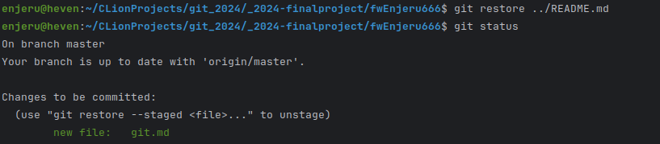
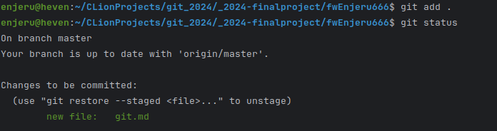
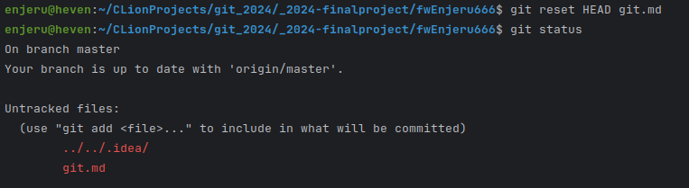
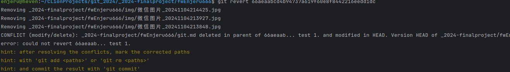
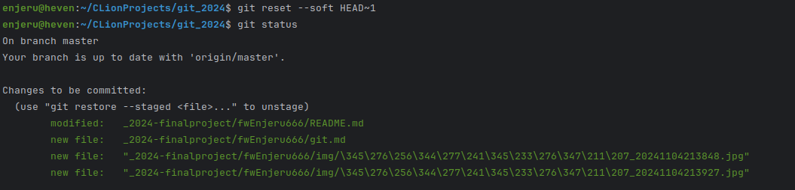
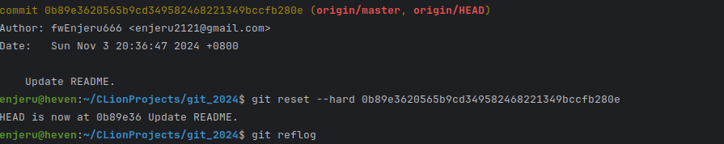
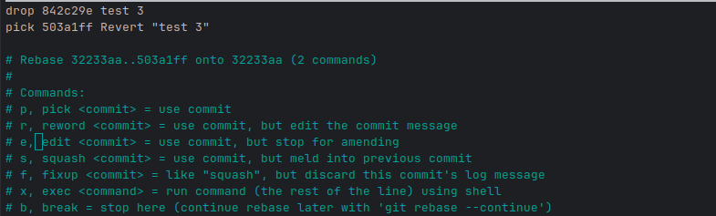
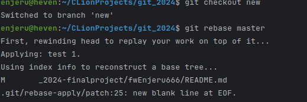
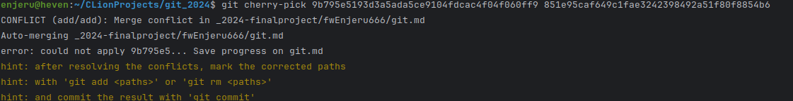

# Q&A

## Q1

1. 使用 git restore --staged
2. 
   
3. 使用 git reset
   

## Q2

### 不修改历史的方式

1.使用 git revert

2.使用 git reset --soft

### 修改历史的方式

1.使用 git reset --hard

2.使用 git rebase -i

## Q3

1.使用 git rebase

2.使用 git cherry-pick

