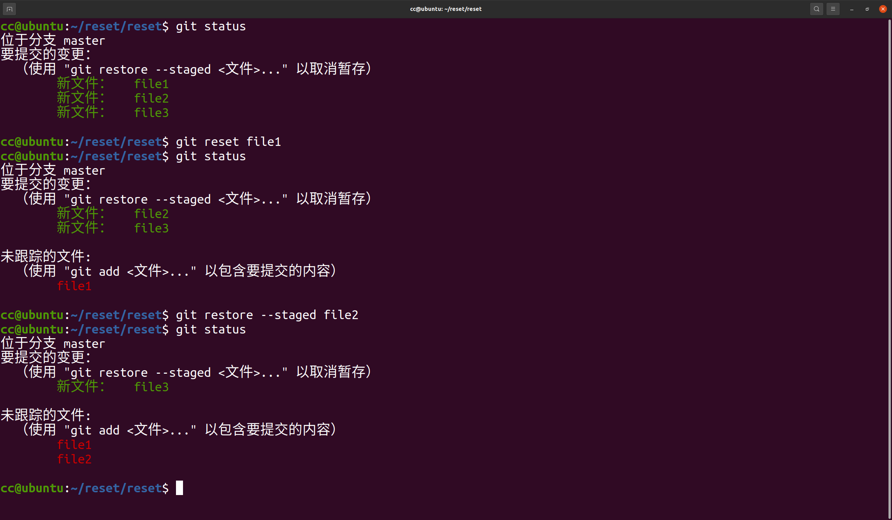
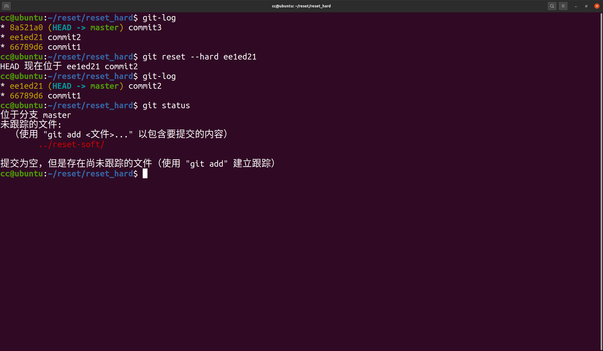
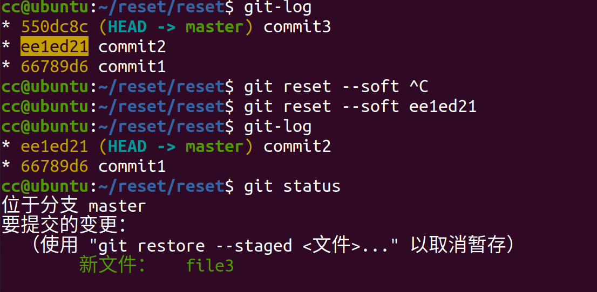
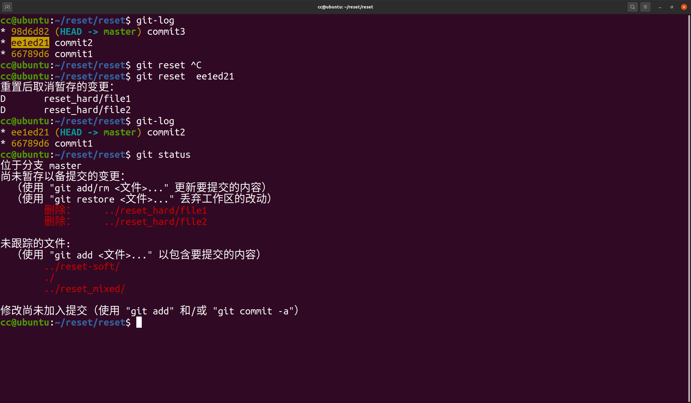
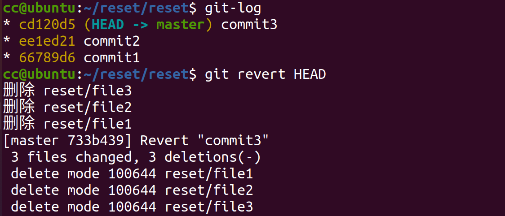
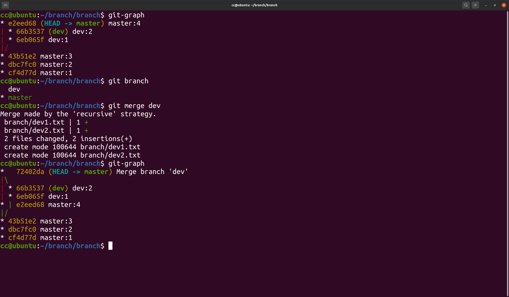
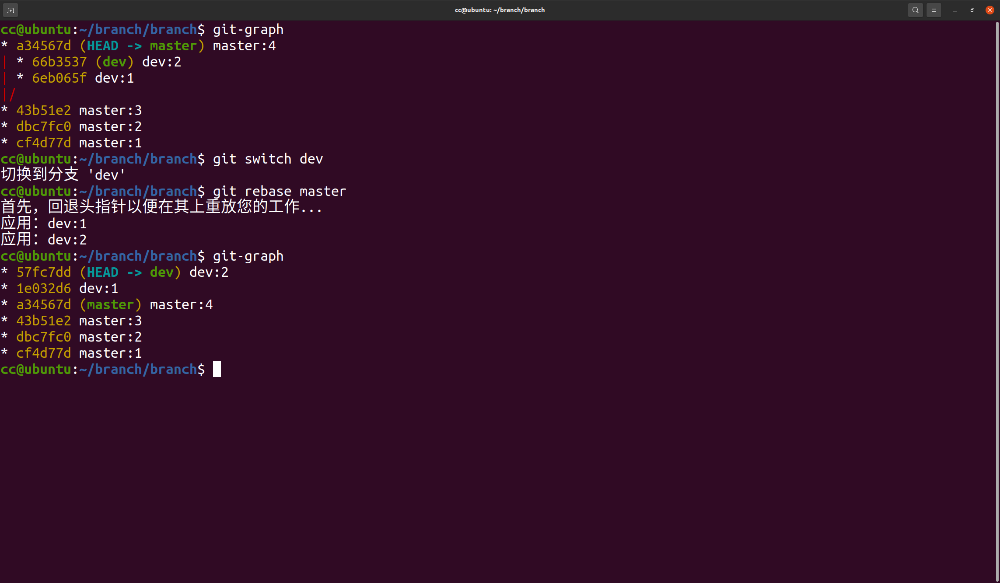

**Git 应用**
1. 回退暂存区的修改

1.1 使用git reset命令:git reset <file>   
1.2 使用 git checkout 命令:git checkout -- <file>
1.3 使用git restore命令:
git restore --staged <file>:取消已经暂存的文件
git restore          <file>:恢复文件内容到上次提交的状态

---

2. 回退已提交的版本
2.1 使用 git revert 命令:git revert <commit>
2.2 使用 git reset 命令:
git reset --hard <commit ID>  (不保留工作区和暂存区)
git reset --soft <commit ID>  (保留工作区和暂存区)
git reset        <commit ID>  (只保留工作区)
    

---

3. 合并分支的不同方式
3.1 使用 git merge 命令:git merge <branch>
3.2 使用 git rebase 命令:git rebase <branch>

