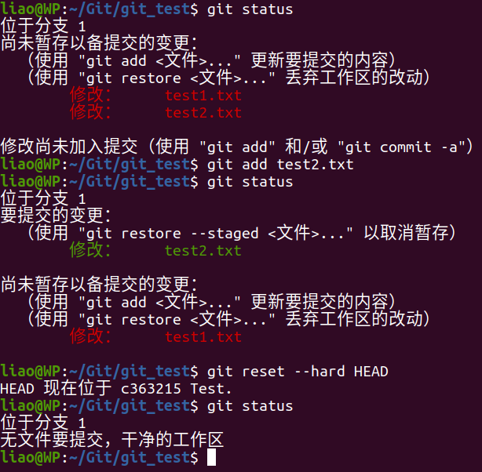
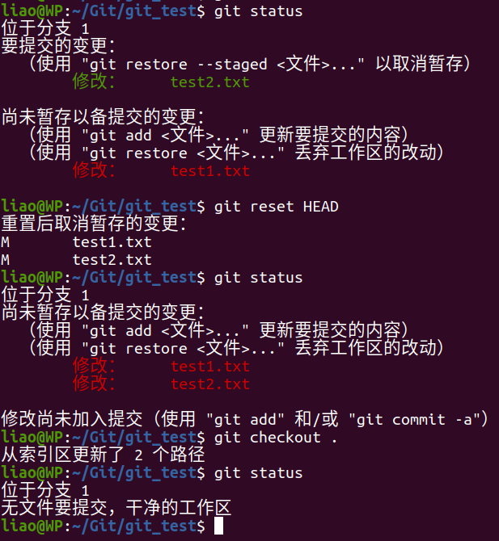
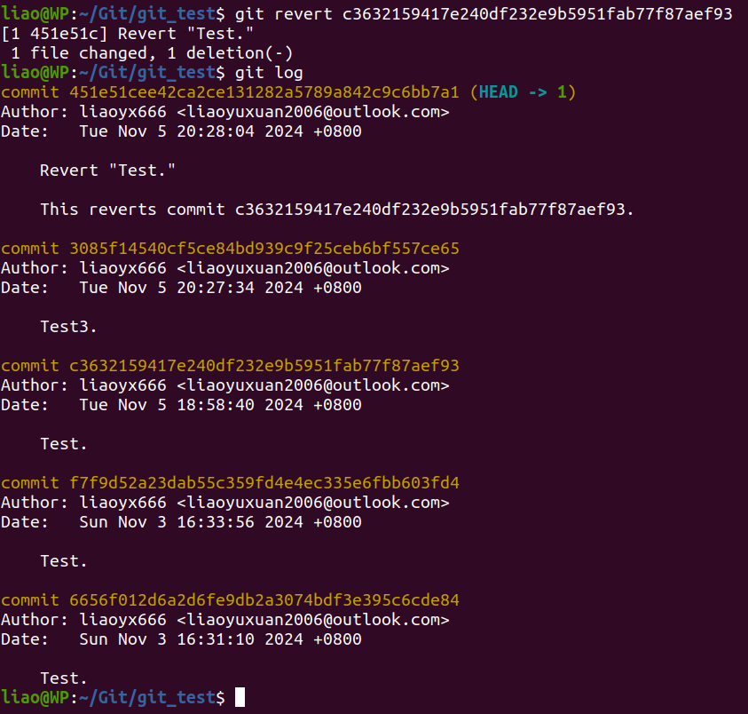
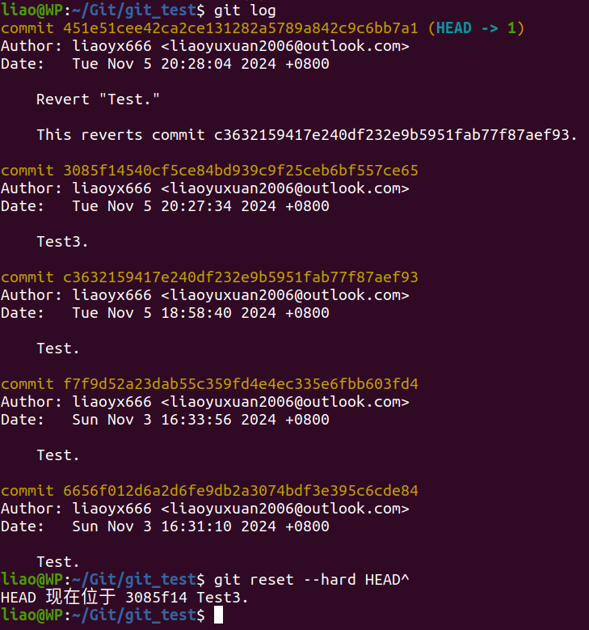
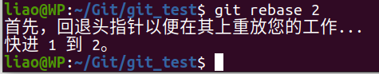

# answers

## 一、
1.将暂存区和工作区都重置到最新提交状态

``git reset --hard HEAD``

2.先撤销将文件存入暂存区的操作

``git reset HEAD``

  再将工作区的所有文件恢复到上一次提交时的状态

``git checkout .``

  

## 二、
1.创建一个新的提交来撤销指定提交所做的更改，不修改历史

``git revert <上一个版本的哈希值>``

2.回退到这个版本之前的版本，修改历史

``git reset --hard HEAD^``

## 三、
1.在被合并的分支执行

``git rebase <主分支>``

2.合并特定提交

``git cherry-pick <特定提交的哈希值>``

