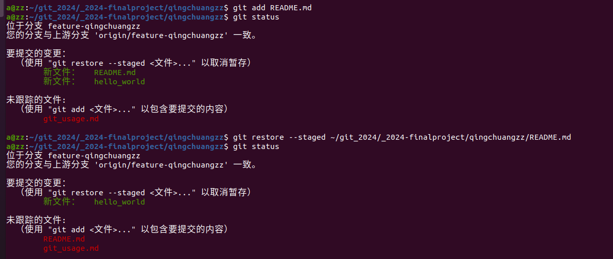
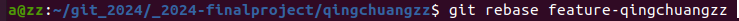

# git应用

##1.回退暂存区的修改

###方式一: 使用'git reset'

如果已经将部分文件加入了暂存区，但还没有提交，可以使用'git reset'命令将它们从暂存区移除,恢复到最后一次提交的状态。

###方式二: 使用'git restore'

##2.回退已提交的版本

###不修改历史的方式一: 使用`git revert``git revert`命令可以创建一个新的提交，这个提交会撤销之前的提交所做的更改。

###不修改历史的方式二：创建一个新的分支，切换到需要回退的提交，并从那里开始新的开发。

###修改历史的方式一：使用`git reset`硬重置，使用`git reset`命令将HEAD指针移动到想要回退到的提交

###修改历史的方式二：使用`git rebase`交互式变基

##3.合并分支的不同方式

###方式一：使用`git fetch`

###方式二：使用`git rebase`

