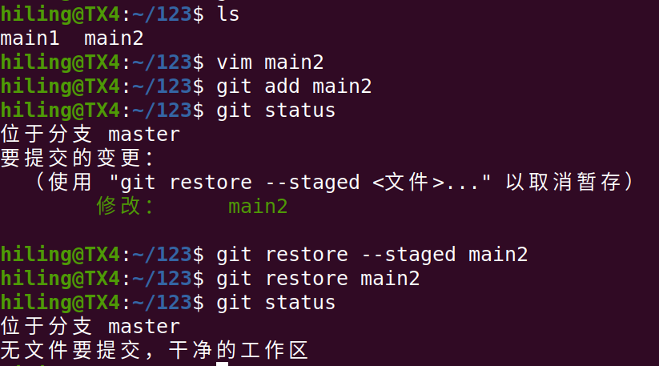
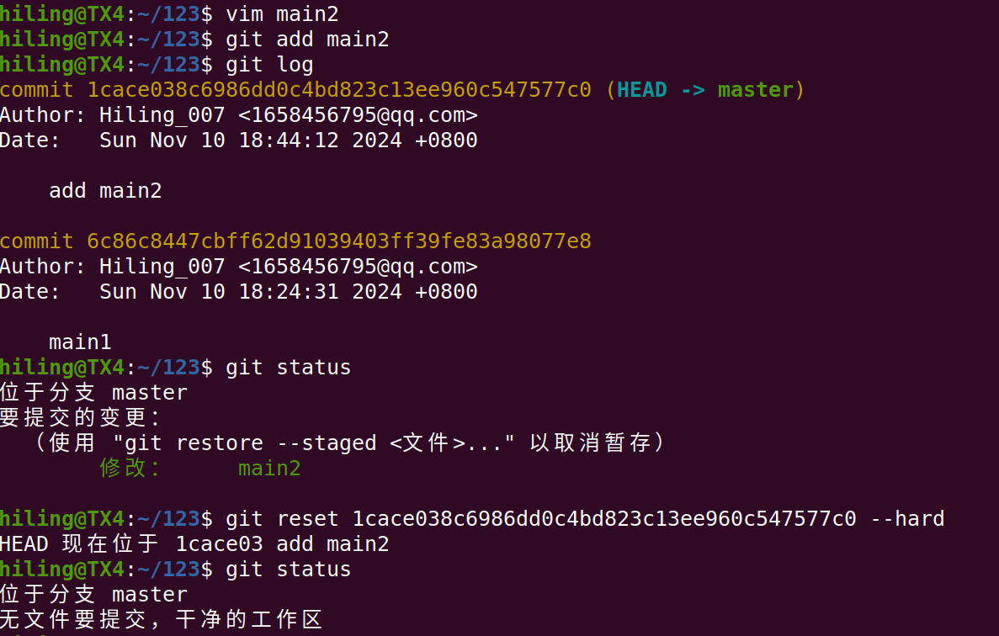
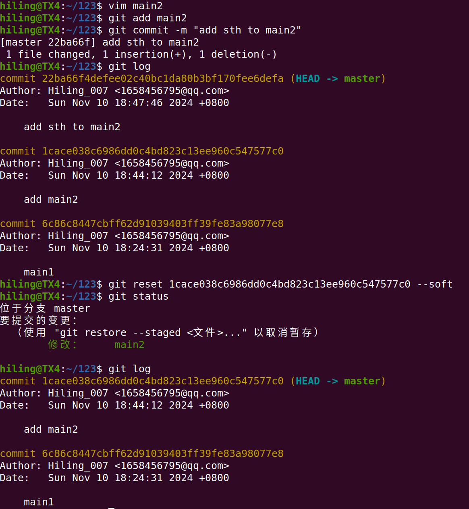
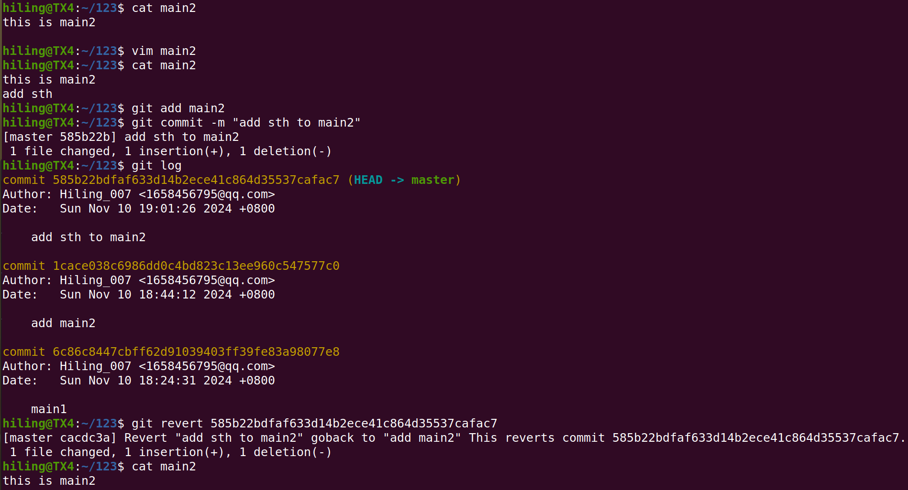
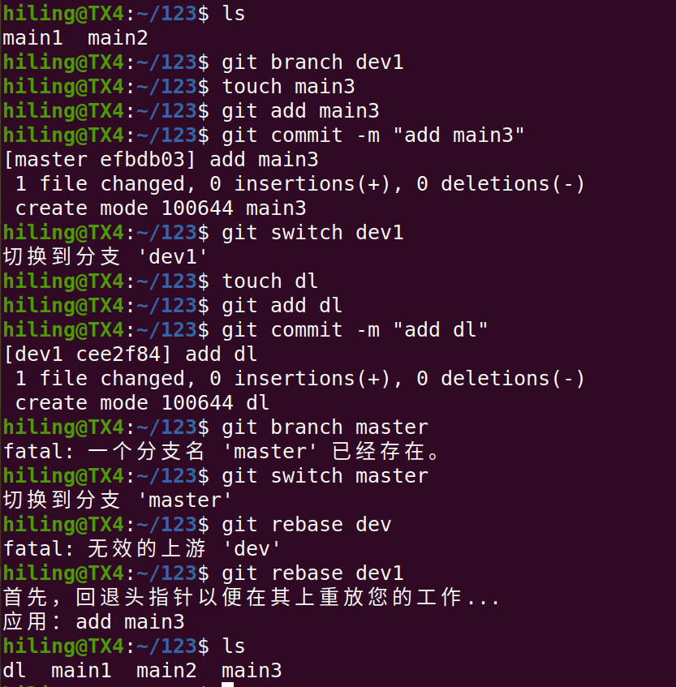
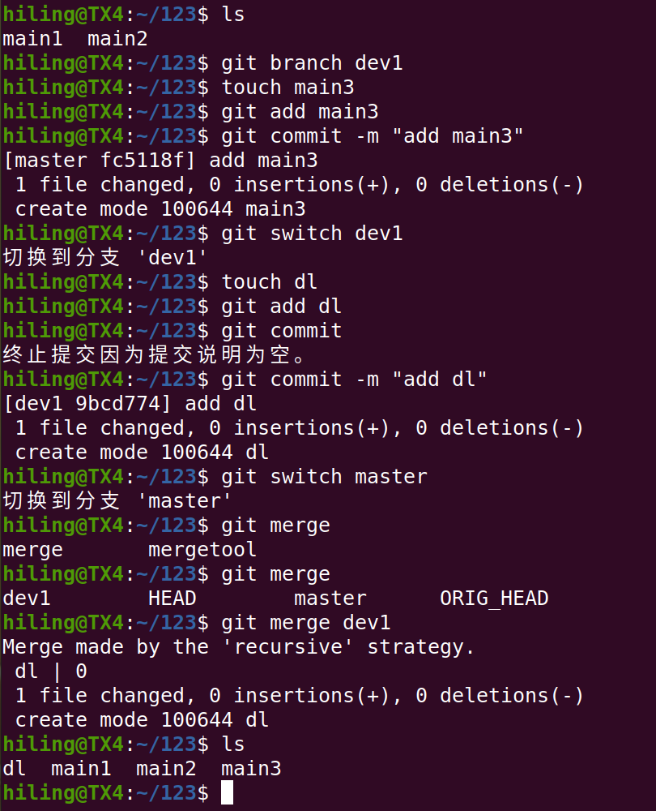

# 杨贻舜的git作业

## 1回退暂存区修改的两种方式
### 方法1：用restore进行回退

### 方法2：用reset回退至最新版本

## 2回退版本的两种方式
### 方法1：用reset回退，不保留历史记录

### 方法2：用revert回退，保留历史记录

## 3合并分支的两种方式
### 方法1：使用rebase合并分支

### 方法2：使用merge合并分支

