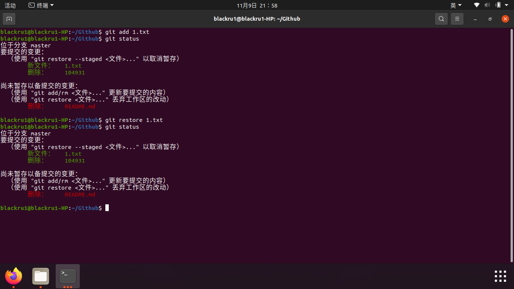
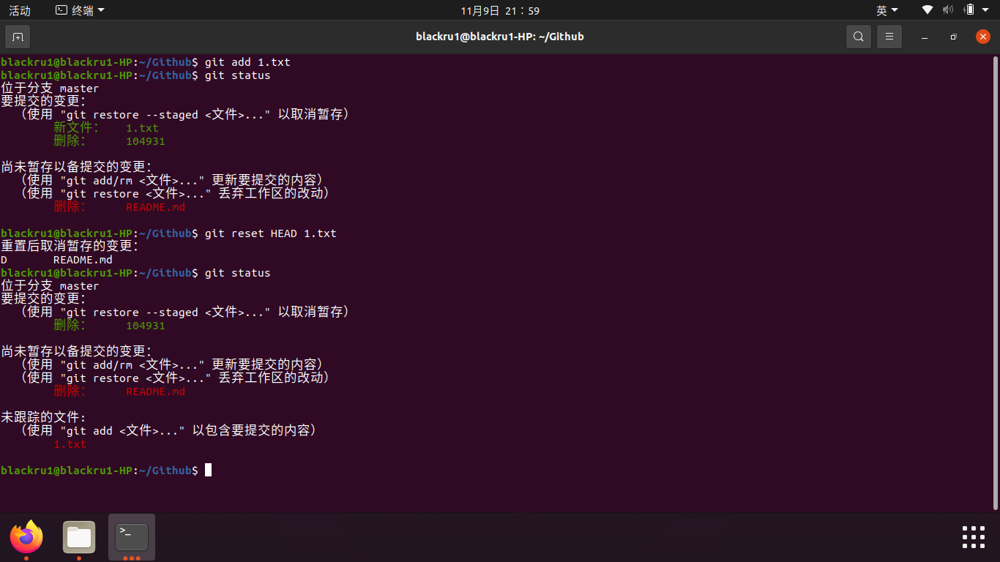
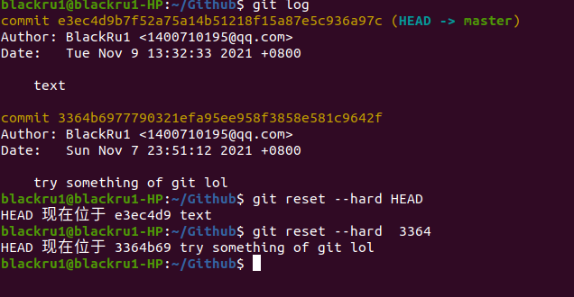
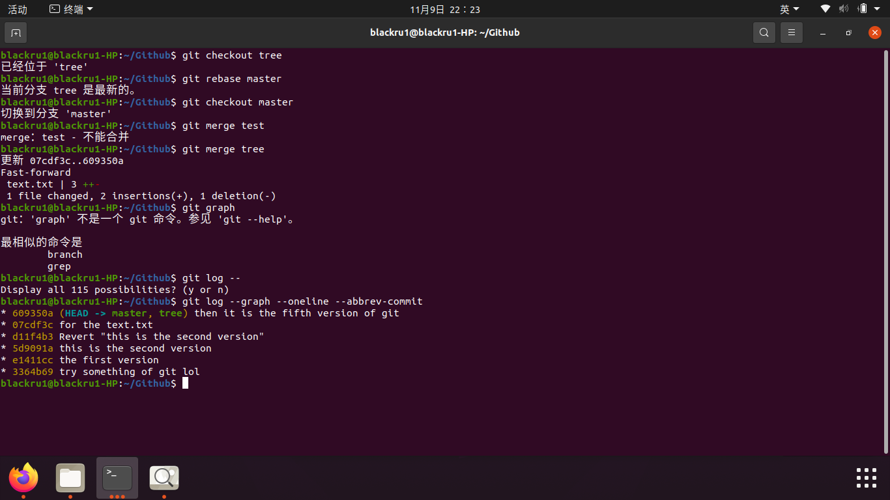

1. #### 若你已经修改了部分文件、并且将其中的一部分加入了暂存区，应该如何回退这些修改，恢复到修改前最后一次提交的状态？给出至少两种不同的方式

   第一种：

   git restore --staged <filename>

   git restore -- <filename>

   

   第二种

   git commit   --amend        撤销上一次提交  并将暂存区文件重新提交
   git checkout -- <file>     拉取暂存区文件 并将其替换成工作区文件
   git reset HEAD  -- <file>  拉取最近一次提交到版本库的文件到暂存区  操作不影响工作区

   

2. #### 若你已经提交了一个新版本，需要回退该版本，应该如何操作？分别给出不修改历史或修改历史的至少两种不同的方式

   (1)$ git reset --hard HEAD
   #回到过去，但是回来要用另外的手段

   #目标版本以后的版本就不见了

   $ git reset --hard <版本号>

   

   (2)$git revert 

   #撤销之前的某一版本，保留目标版本后面的版本

   

3. #### 我们已经知道了合并分支可以使用 merge，但这不是唯一的方法，给出至少两种不同的合并分支的方式。

   主要其实就是两种：merge和rebase

   （1）merge， 能保留完整的工作历史。

   git checkout feature
   git merge master

   

   （2）rebase，使得项目历史整洁（与merge有点相对），而且出来的项目线性。
   
   git checkout feature
   git rebase master
   
   

