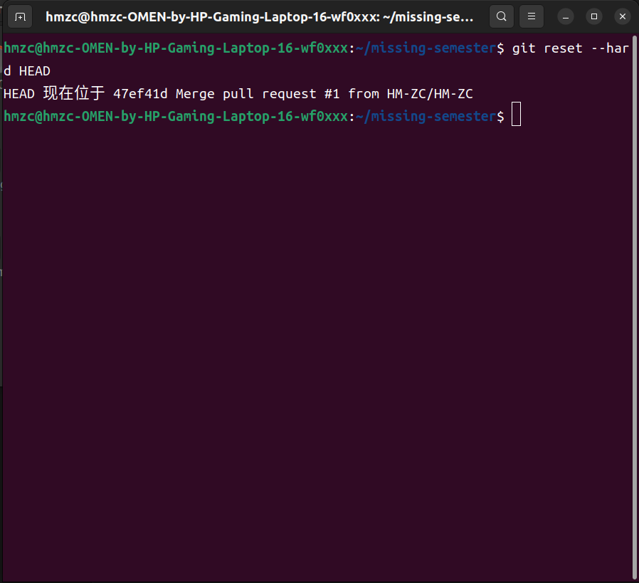
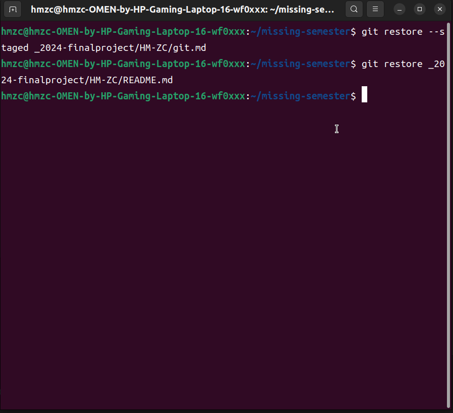
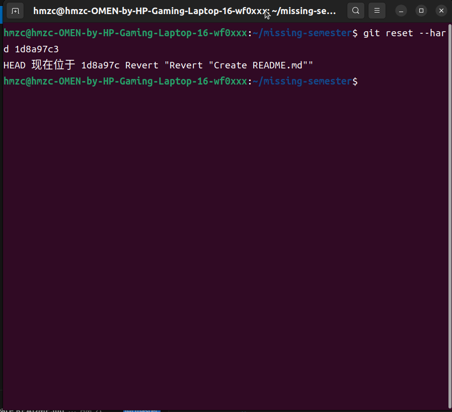
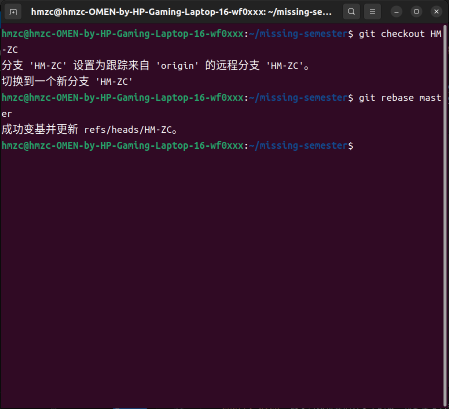
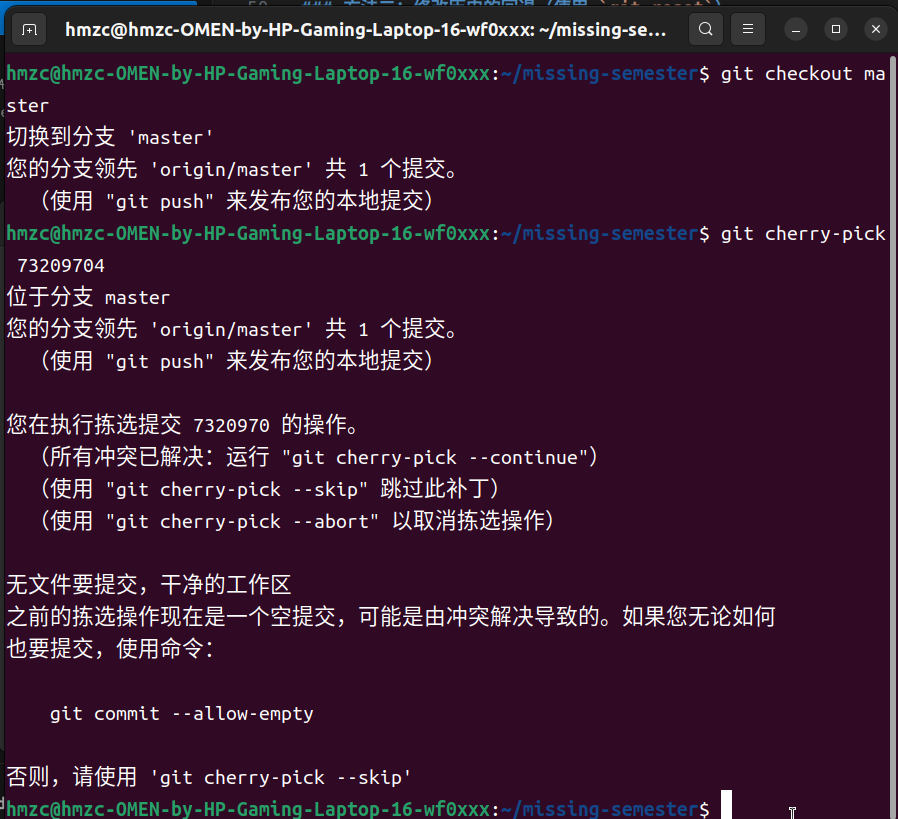

## 问题 1：

### 方法一：

1. **命令**：
   ```bash
   git reset --hard HEAD
   ```
   
2. **截图**：
   - 

### 方法二：

1. **取消暂存区的更改**：
   ```bash
   git restore --staged <file>
   ```

2. **回退工作区的更改**：
   ```bash
   git restore <file>
   ```

3. **截图**：
   - 

## 问题 2：回退已提交的版本


### 方法一：

1. **命令**：
   ```bash
   git revert <commit_hash>
   ```

2. **截图**：
   - 

### 方法二：

1. **命令**：
   ```bash
   git reset --hard <commit_hash>
   ```

2. **截图**：
   - 

## 问题 3：

### 方法一：

1. **命令**：
   ```bash
   git checkout feature-branch
   git rebase main
   ```

2. **截图**：
   - 

### 方法二：

1. **命令**：
   ```bash
   git checkout main
   git cherry-pick <commit_hash>
   ```
   
2. **截图**：
   - 
