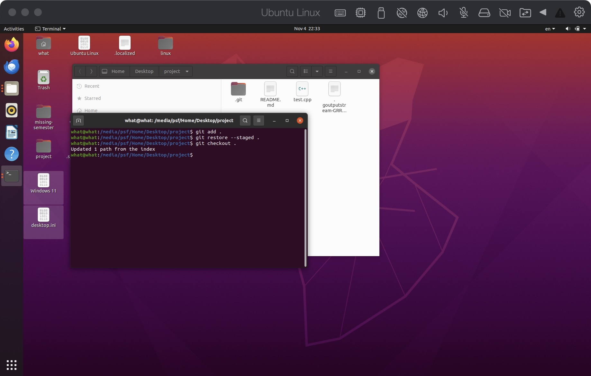
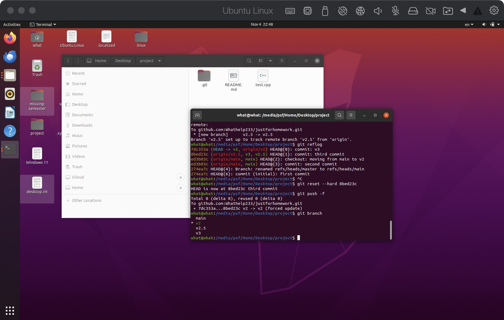
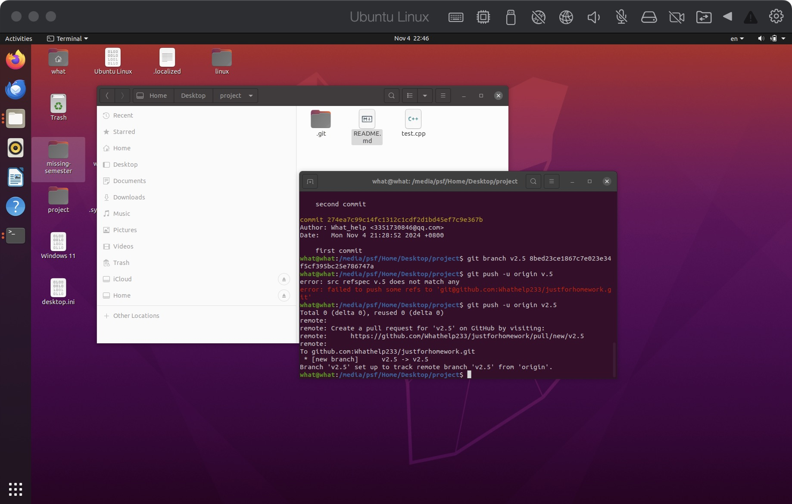
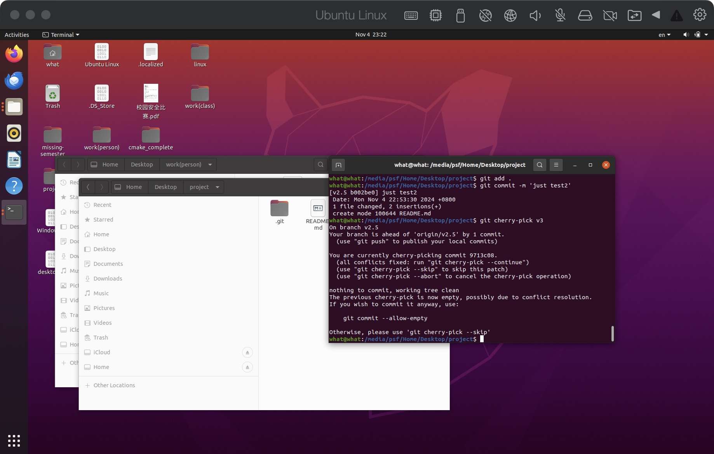

1. 若你已经修改了部分文件、并且将其中的一部分加入了暂存区，应该如何回退这些修改，恢复到修改前最后一次提交的状态？给出至少两种不同的方式
ans:我们可以使用
`git restore .`
或者
`git reset HEAD <file> .`
参考：



  2. 若你已经提交了一个新版本，需要回退该版本，应该如何操作？分别给出不修改历史或修改历史的至少两种不同的方式
ans:
不修改历史（？）：首先用
`git log`

 查找commit号
 然后用基于这个版本号新建一个分支，并推送
```
git branch <new_branch_name> <commit_number>
git push <remote> <new_branch_name>
 git checkout <target_branch_name>
```

修改分支：
```
git reflog
git reset --hard commit_id
git push -f
```

3. 我们已经知道了合并分支可以使用 merge，但这不是唯一的方法，给出至少两种不同的合并分支的方式
ans:第一个
```
git rebase <target_feature>
```

第二个：cherry-pick
```
git cherry-pick <commithash>
```

